# 1.垃圾回收算法

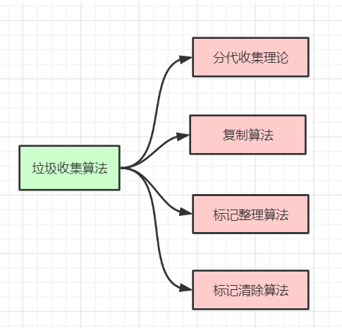

# 2.垃圾回收器

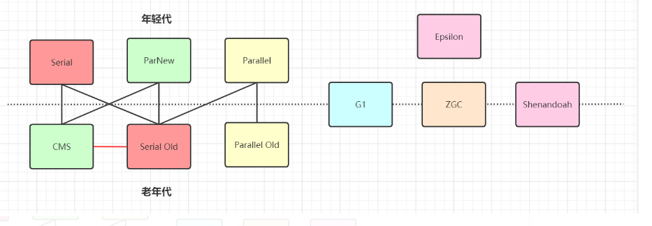

## 2.1 Serial收集器(-XX:+UseSerialGC  -XX:+UseSerialOldGC)

    Serial（串行）收集器是最基本、历史最悠久的垃圾收集器了。大家看名字就知道这个收集器是一个单线程收集器了。
    它的 “单线程” 的意义不仅仅意味着它只会使用一条垃圾收集线程去完成垃圾收集工作，更重要的是它在进行垃圾收集
    工作的时候必须暂停其他所有的工作线程（ "Stop The World" ），直到它收集结束。
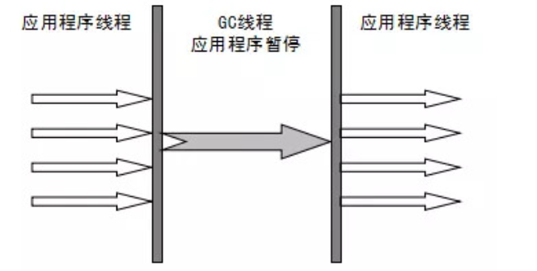

## 2.2 Parallel Scavenge收集器(-XX:+UseParallelGC(年轻代),-XX:+UseParallelOldGC(老年代))

    Parallel收集器其实就是Serial收集器的多线程版本，除了使用多线程进行垃圾收集外，
    其余行为（控制参数、收集算法、回收策略等等）和Serial收集器类似。默认的收集线程数跟cpu核数相同，
    当然也可以用参数(-XX:ParallelGCThreads)指定收集线程数，但是一般不推荐修改。

    Parallel Scavenge收集器关注点是吞吐量（高效率的利用CPU）。
    CMS等垃圾收集器的关注点更多的是用户线程的停顿时间（提高用户体验）。
    所谓吞吐量就是CPU中用于运行用户代码的时间与CPU总消耗时间的比值。 
    Parallel Scavenge收集器提供了很多参数供用户找到最合适的停顿时间或最大吞吐量

新生代采用复制算法，老年代采用标记-整理算法。

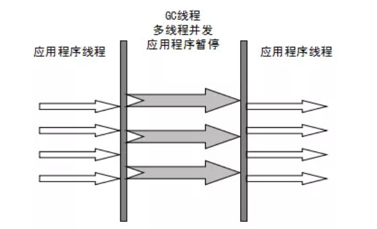

    Parallel Old收集器是Parallel Scavenge收集器的老年代版本。使用多线程和“标记-整理”算法。
    在注重吞吐量以及CPU资源的场合，都可以优先考虑 Parallel Scavenge收集器和Parallel Old收集器
    (JDK8默认的新生代和老年代收集器)。

## 2.3 ParNew收集器(-XX:+UseParNewGC)
    
    ParNew收集器其实跟Parallel收集器很类似，区别主要在于它可以和CMS收集器配合使用。

新生代采用复制算法，老年代采用标记-整理算法。

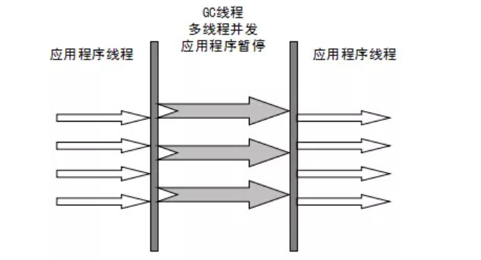
    

## 2.4 CMS收集器(-XX:+UseConcMarkSweepGC(old))

    CMS（Concurrent Mark Sweep）收集器是一种以获取最短回收停顿时间为目标的收集器。
    它非常符合在注重用户体验的应用上使用，它是HotSpot虚拟机第一款真正意义上的并发收集器，
    它第一次实现了让垃圾收集线程与用户线程（基本上）同时工作。

    从名字中的Mark Sweep这两个词可以看出，CMS收集器是一种 “标记-清除”算法实现的，
    它的运作过程相比于前面几种垃圾收集器来说更加复杂一些。

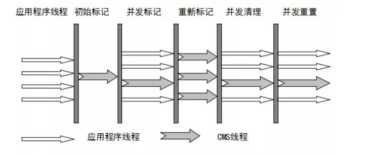

整个过程分为四个步骤：

    🚀 初始标记：暂停所有的其他线程(STW)，并记录下gc roots直接能引用的对象，速度很快。
    🚀 并发标记：并发标记阶段就是从GC Roots的直接关联对象开始遍历整个对象图的过程，
        这个过程耗时较长但是不需要停顿用户线程， 可以与垃圾收集线程一起并发运行。
        因为用户程序继续运行，可能会有导致已经标记过的对象状态发生改变。
    🚀 重新标记：重新标记阶段就是为了修正并发标记期间因为用户程序继续运行而导致标记产生变动
        的那一部分对象的标记记录(主要是处理漏标问题)，这个阶段的停顿时间一般会比初始标记阶段的时间稍长，
        远远比并发标记阶段时间短。主要用到三色标记里的增量更新算法(见下面详解)做重新标记。
    🚀 并发清理：开启用户线程，同时GC线程开始对未标记的区域做清扫。
        这个阶段如果有新增对象会被标记为黑色不做任何处理(见下面三色标记算法详解)。
    🚀 并发重置：重置本次GC过程中的标记数据。

CMS的相关核心参数

    🚀 -XX:+UseConcMarkSweepGC：启用cms
    🚀 -XX:ConcGCThreads：并发的GC线程数
    🚀 -XX:+UseCMSCompactAtFullCollection：FullGC之后做压缩整理（减少碎片）
    🚀 -XX:CMSFullGCsBeforeCompaction：多少次FullGC之后压缩一次，默认是0，代表每次FullGC后都会压缩一次  
    🚀 -XX:CMSInitiatingOccupancyFraction: 当老年代使用达到该比例时会触发FullGC（默认是92，这是百分比）
    🚀 -XX:+UseCMSInitiatingOccupancyOnly：只使用设定的回收阈值(-XX:CMSInitiatingOccupancyFraction设定的值)，如果不指定，JVM仅在第一次使用设定值，后续则会自动调整
    🚀 -XX:+CMSScavengeBeforeRemark：在CMS GC前启动一次minor gc，降低CMS GC标记阶段(也会对年轻代一起做标记，如果在minor gc就干掉了很多对垃圾对象，标记阶段就会减少一些标记时间)时的开销，一般CMS的GC耗时 80%都在标记阶段
    🚀 -XX:+CMSParallellnitialMarkEnabled：表示在初始标记的时候多线程执行，缩短STW
    🚀 -XX:+CMSParallelRemarkEnabled：在重新标记的时候多线程执行，缩短STW;

## 2.5 G1
G1 (Garbage-First)是一款面向服务器的垃圾收集器,主要针对配备多颗处理器及大容量内存的机器. 
以极高概率满足GC停顿时间要求的同时,还具备高吞吐量性能特征.

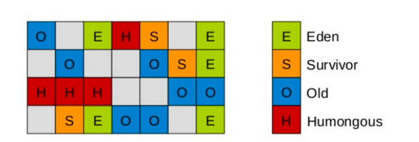

    G1将Java堆划分为多个大小相等的独立区域（Region），JVM目标是不超过2048个Region(JVM源码里TARGET_REGION_NUMBER 定义)，
    实际可以超过该值，但是不推荐。
    一般Region大小等于堆大小除以2048，比如堆大小为4096M，则Region大小为2M，当然也可以用参数"-XX:G1HeapRegionSize"手动指定Region大小，但是推荐默认的计算方式。
    G1保留了年轻代和老年代的概念，但不再是物理隔阂了，它们都是（可以不连续）Region的集合。
    默认年轻代对堆内存的占比是5%，如果堆大小为4096M，那么年轻代占据200MB左右的内存，对应大概是100个Region，
    可以通过“-XX:G1NewSizePercent”设置新生代初始占比，在系统运行中，JVM会不停的给年轻代增加更多的Region，
    但是最多新生代的占比不会超过60%，可以通过“-XX:G1MaxNewSizePercent”调整。年轻代中的Eden和Survivor对应的region也跟之前一样，
    默认8:1:1，假设年轻代现在有1000个region，eden区对应800个，s0对应100个，s1对应100个。
    一个Region可能之前是年轻代，如果Region进行了垃圾回收，之后可能又会变成老年代，也就是说Region的区域功能可能会动态变化。

    唯一不同的是对大对象的处理，G1有专门分配大对象的Region叫Humongous区，而不是让大对象直接进入老年代的Region中。
    在G1中，大对象的判定规则就是一个大对象超过了一个Region大小的50%，比如按照上面算的，每个Region是2M，
    只要一个大对象超过了1M，就会被放入Humongous中，而且一个大对象如果太大，可能会横跨多个Region来存放

    Humongous区专门存放短期巨型对象，不用直接进老年代，可以节约老年代的空间，避免因为老年代空间不够的GC开销。

    Full GC的时候除了收集年轻代和老年代之外，也会将Humongous区一并回收。

G1收集器一次GC(主要值Mixed GC)的运作过程大致分为以下几个步骤：

    🚀 初始标记（initial mark，STW）：暂停所有的其他线程，并记录下gc roots直接能引用的对象，速度很快 
    🚀 并发标记（Concurrent Marking）：同CMS的并发标记
    🚀 最终标记（Remark，STW）：同CMS的重新标记
    🚀 筛选回收（Cleanup，STW）：筛选回收阶段首先对各个Region的回收价值和成本进行排序，
    根据用户所期望的GC停顿STW时间(可以用JVM参数 -XX:MaxGCPauseMillis指定)来制定回收计划，
    比如说老年代此时有1000个Region都满了，但是因为根据预期停顿时间，本次垃圾回收可能只能停顿200毫秒，
    那么通过之前回收成本计算得知，可能回收其中800个Region刚好需要200ms，
    那么就只会回收800个Region(Collection Set，要回收的集合)，尽量把GC导致的停顿时间控制在我们指定的范围内。
    这个阶段其实也可以做到与用户程序一起并发执行，但是因为只回收一部分Region，时间是用户可控制的，而且停顿用户线程将大幅提高收集效率。
    不管是年轻代或是老年代，回收算法主要用的是复制算法，将一个region中的存活对象复制到另一个region中，
    这种不会像CMS那样回收完因为有很多内存碎片还需要整理一次，G1采用复制算法回收几乎不会有太多内存碎片。
    (注意：CMS回收阶段是跟用户线程一起并发执行的，G1因为内部实现太复杂暂时没实现并发回收，不过到了ZGC，
    Shenandoah就实现了并发收集，Shenandoah可以看成是G1的升级版本)
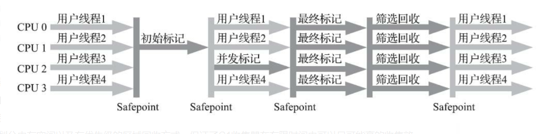
    

    由用户指定期望的停顿时间是G1收集器很强大的一个功能， 设置不同的期望停顿时间， 
    可使得G1在不同应用场景中取得关注吞吐量和关注延迟之间的最佳平衡。 不过， 这里设置的“期望值”必须是符合实际的， 
    不能异想天开， 毕竟G1是要冻结用户线程来复制对象的， 这个停顿时间再怎么低也得有个限度。 
    它默认的停顿目标为两百毫秒， 一般来说， 回收阶段占到几十到一百甚至接近两百毫秒都很正常， 
    但如果我们把停顿时间调得非常低， 譬如设置为二十毫秒， 很可能出现的结果就是由于停顿目标时间太短， 
    导致每次选出来的回收集只占堆内存很小的一部分， 收集器收集的速度逐渐跟不上分配器分配的速度， 
    导致垃圾慢慢堆积。 很可能一开始收集器还能从空闲的堆内存中获得一些喘息的时间， 但应用运行时间一长就不行了， 
    最终占满堆引发Full GC反而降低性能， 所以通常把期望停顿时间设置为一两百毫秒或者两三百毫秒会是比较合理的。

#### G1垃圾收集分类

YoungGC

    YoungGC并不是说现有的Eden区放满了就会马上触发，G1会计算下现在Eden区回收大概要多久时间，
    如果回收时间远远小于参数 -XX:MaxGCPauseMills 设定的值，那么增加年轻代的region，
    继续给新对象存放，不会马上做Young GC，直到下一次Eden区放满，G1计算回收时间接近参数 -XX:MaxGCPauseMills 
    设定的值，那么就会触发Young GC

MixedGC

    不是FullGC，老年代的堆占有率达到参数(-XX:InitiatingHeapOccupancyPercent)设定的值则触发，
    回收所有的Young和部分Old(根据期望的GC停顿时间确定old区垃圾收集的优先顺序)以及大对象区，
    正常情况G1的垃圾收集是先做MixedGC，主要使用复制算法，需要把各个region中存活的对象拷贝到别的region里去，
    拷贝过程中如果发现没有足够的空region能够承载拷贝对象就会触发一次Full GC

Full GC

    停止系统程序，然后采用单线程进行标记、清理和压缩整理，好空闲出来一批Region来供下一次MixedGC使用，
    这个过程是非常耗时的。(Shenandoah优化成多线程收集了)

G1收集器参数设置
    
    -XX:+UseG1GC:使用G1收集器
    -XX:ParallelGCThreads:指定GC工作的线程数量
    -XX:G1HeapRegionSize:指定分区大小(1MB~32MB，且必须是2的N次幂)，默认将整堆划分为2048个分区
    -XX:MaxGCPauseMillis:目标暂停时间(默认200ms)
    -XX:G1NewSizePercent:新生代内存初始空间(默认整堆5%，值配置整数，默认就是百分比)
    -XX:G1MaxNewSizePercent:新生代内存最大空间
    -XX:TargetSurvivorRatio:Survivor区的填充容量(默认50%)，Survivor区域里的 
        一批对象(年龄1+年龄2+年龄n的多个年龄对象)总和超过了Survivor区域的50%，此时就会把年龄n(含)以上的对象都放入老年代
    -XX:MaxTenuringThreshold:最大年龄阈值(默认15)
    -XX:InitiatingHeapOccupancyPercent:老年代占用空间达到整堆内存阈值(默认45%)，
        则执行新生代和老年代的混合收集(MixedGC)，比如我们之前说的堆默认有2048个region，
        如果有接近1000个region都是老年代的region，则可能就要触发MixedGC了
    -XX:G1MixedGCLiveThresholdPercent(默认85%)  region中的存活对象低于这个值时才会回收该region，
        如果超过这个值，存活对象过多，回收的的意义不大。
    -XX:G1MixedGCCountTarget:在一次回收过程中指定做几次筛选回收(默认8次)，在最后一个筛选回收阶段可以回收一会，
        然后暂停回收，恢复系统运行，一会再开始回收，这样可以让系统不至于单次停顿时间过长。
    -XX:G1HeapWastePercent(默认5%): gc过程中空出来的region是否充足阈值，在混合回收的时候，
        对Region回收都是基于复制算法进行的，都是把要回收的Region里的存活对象放入其他Region，
        然后这个Region中的垃圾对象全部清理掉，这样的话在回收过程就会不断空出来新的Region，
        一旦空闲出来的Region数量达到了堆内存的5%，此时就会立即停止混合回收，意味着本次混合回收就结束了。

什么场景适合使用G1？

    🚀 50%以上的堆被存活对象占用
    🚀 对象分配和晋升的速度变化非常大
    🚀 垃圾回收时间特别长，超过1秒
    🚀 8GB以上的堆内存(建议值)
    🚀 停顿时间是500ms以内

## 2.6 ZGC
    
    🚀 支持TB量级的堆。我们生产环境的硬盘还没有上TB呢，这应该可以满足未来十年内，所有JAVA应用的需求了吧。
    🚀 最大GC停顿时间不超10ms。目前一般线上环境运行良好的JAVA应用Minor GC停顿时间在10ms左右，
        Major GC一般都需要100ms以上（G1可以调节停顿时间，但是如果调的过低的话，反而会适得其反），
        之所以能做到这一点是因为它的停顿时间主要跟Root扫描有关，而Root数量和堆大小是没有任何关系的。
    🚀 奠定未来GC特性的基础。
    🚀 最糟糕的情况下吞吐量会降低15%。这都不是事，停顿时间足够优秀。至于吞吐量，通过扩容分分钟解决。

    另外，Oracle官方提到了它最大的优点是：它的停顿时间不会随着堆的增大而增长！也就是说，几十G堆的停顿时间是10ms以下，
    几百G甚至上T堆的停顿时间也是10ms以下。

不分代(暂时)

    
    单代，即ZGC「没有分代」。我们知道以前的垃圾回收器之所以分代，是因为源于“「大部分对象朝生夕死」”的假设，
    事实上大部分系统的对象分配行为也确实符合这个假设。
    那么为什么ZGC就不分代呢？因为分代实现起来麻烦，作者就先实现出一个比较简单可用的单代版本，后续会优化。

ZGC内存布局

    
    ZGC收集器是一款基于Region内存布局的， 暂时不设分代的， 使用了读屏障、 颜色指针等技术来实现可并发的标记-整理算法的， 
    以低延迟为首要目标的一款垃圾收集器。
    ZGC的Region可以具有如图3-19所示的大、 中、 小三类容量：
    🚀 小型Region（Small Region） ： 容量固定为2MB， 用于放置小于256KB的小对象。
    🚀 中型Region（Medium Region） ： 容量固定为32MB， 用于放置大于等于256KB但小于4MB的对象。
    🚀 大型Region（Large Region） ： 容量不固定， 可以动态变化， 但必须为2MB的整数倍， 
        用于放置4MB或以上的大对象。 每个大型Region中只会存放一个大对象， 这也预示着虽然名字叫作“大型Region”， 
        但它的实际容量完全有可能小于中型Region， 最小容量可低至4MB。 大型Region在ZGC的实现中是不会被重分配
        （重分配是ZGC的一种处理动作， 用于复制对象的收集器阶段， 稍后会介绍到）的， 因为复制一个大对象的代价非常高昂。

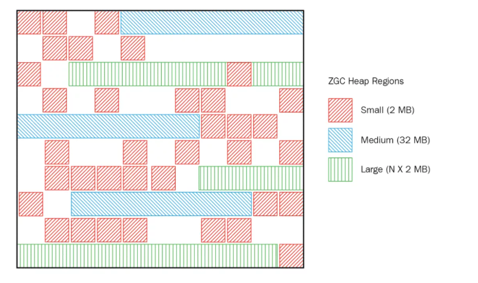

ZGC运作过程

并发标记（Concurrent Mark）：

    与G1一样，并发标记是遍历对象图做可达性分析的阶段，它的初始标记(Mark Start)和最终标记(Mark End)也会出现短暂的停顿，与G1不同的是， ZGC的标记是在指针上而不是在对象上进行的， 标记阶段会更新颜色指针(见下面详解)中的Marked 0、 Marked 1标志位。
    并发预备重分配（Concurrent Prepare for Relocate）：

    这个阶段需要根据特定的查询条件统计得出本次收集过程要清理哪些Region，将这些Region组成重分配集（Relocation Set）。
    ZGC每次回收都会扫描所有的Region，用范围更大的扫描成本换取省去G1中记忆集的维护成本。

并发重分配（Concurrent Relocate）：

    重分配是ZGC执行过程中的核心阶段，这个过程要把重分配集中的存活对象复制到新的Region上，
    并为重分配集中的每个Region维护一个转发表（Forward Table），记录从旧对象到新对象的转向关系。
    ZGC收集器能仅从引用上就明确得知一个对象是否处于重分配集之中，如果用户线程此时并发访问了位于重分配集中的对象，
    这次访问将会被预置的内存屏障(读屏障(见下面详解))所截获，然后立即根据Region上的转发表记录将访问转发到新复制的对象上，
    并同时修正更新该引用的值，使其直接指向新对象，ZGC将这种行为称为指针的“自愈”（Self-Healing）能力。

并发重映射（Concurrent Remap）：

    重映射所做的就是修正整个堆中指向重分配集中旧对象的所有引用，但是ZGC中对象引用存在“自愈”功能，
    所以这个重映射操作并不是很迫切。ZGC很巧妙地把并发重映射阶段要做的工作，合并到了下一次垃圾收集循环中的并发标记阶段里去完成，
    反正它们都是要遍历所有对象的，这样合并就节省了一次遍历对象图的开销。一旦所有指针都被修正之后， 
    原来记录新旧对象关系的转发表就可以释放掉了。

ZGC触发时机

    ZGC目前有4中机制触发GC：
    🚀 定时触发，默认为不使用，可通过ZCollectionInterval参数配置。
    🚀 预热触发，最多三次，在堆内存达到10%、20%、30%时触发，主要时统计GC时间，为其他GC机制使用。
    🚀 分配速率，基于正态分布统计，计算内存99.9%可能的最大分配速率，以及此速率下内存将要耗尽的时间点，
    在耗尽之前触发GC（耗尽时间 - 一次GC最大持续时间 - 一次GC检测周期时间）。
    🚀 主动触发，（默认开启，可通过ZProactive参数配置） 距上次GC堆内存增长10%，或超过5分钟时，
    对比距上次GC的间隔时间跟（49 * 一次GC的最大持续时间），超过则触发。

# 3.垃圾收集底层算法实现

## 三色标记法

在并发标记的过程中，因为标记期间应用线程还在继续跑，对象间的引用可能发生变化，
多标和漏标的情况就有可能发生。漏标的问题主要引入了三色标记算法来解决。

    三色标记算法是把Gc roots可达性分析遍历对象过程中遇到的对象， 按照“是否访问过”这个条件标记成以下三种颜色：
    🚀 黑色： 表示对象已经被垃圾收集器访问过， 且这个对象的所有引用都已经扫描过。 黑色的对象代表已经扫描过， 
        它是安全存活的， 如果有其他对象引用指向了黑色对象， 无须重新扫描一遍。 黑色对象不可能直接（不经过灰色对象） 指向某个白色对象。
    🚀 灰色： 表示对象已经被垃圾收集器访问过， 但这个对象上至少存在一个引用还没有被扫描过。
    🚀 白色： 表示对象尚未被垃圾收集器访问过。 显然在可达性分析刚刚开始的阶段， 所有的对象都是白色的， 
        若在分析结束的阶段， 仍然是白色的对象， 即代表不可达

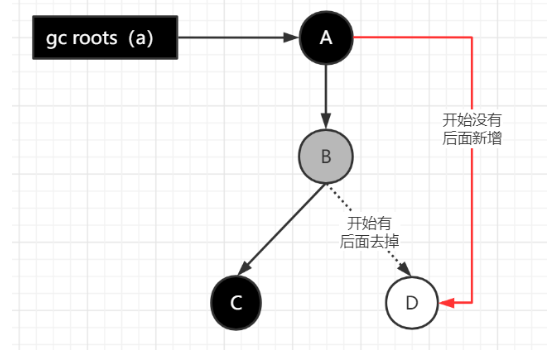    

#### Java GCRoot

    🚀 虚拟机内部的引用，比如类加载器等；
    🚀 native，本地方法栈引用的对象(在本地方法栈)
    🚀 final，常量引用的对象（比如字符串常量池的引用；在方法区）
    🚀 static，静态变量引用的对象（比如Java类的引用类型静态变量；在方法区）
    🚀 synchronzied引用的对象(所有被同步锁持有的对象；在堆里)
    🚀 jvm虚拟机栈引用的对象(比如：各个线程被调用的方法堆栈中用到的参数、局部变量和临时变量；在jvm虚拟机栈中)
    🚀 Thread，活动的线程
    🚀 Class对象，由BootstrapClassLoader加载的对象是不能被回收的

## 漏标-读写屏障

    漏标会导致被引用的对象被当成垃圾误删除，这是严重bug，必须解决，有两种解决方案：
增量更新（Incremental Update） 和原始快照（Snapshot At The Beginning，SATB）

    增量更新就是当黑色对象插入新的指向白色对象的引用关系时， 就将这个新插入的引用记录下来， 
    等并发扫描结束之后， 再将这些记录过的引用关系中的黑色对象为根， 重新扫描一次。 
    这可以简化理解为， 黑色对象一旦新插入了指向白色对象的引用之后， 它就变回灰色对象了。

    原始快照就是当灰色对象要删除指向白色对象的引用关系时， 就将这个要删除的引用记录下来， 
    在并发扫描结束之后， 再将这些记录过的引用关系中的灰色对象为根， 重新扫描一次，这样就能扫描到白色的对象，
    将白色对象直接标记为黑色(目的就是让这种对象在本轮gc清理中能存活下来，待下一轮gc的时候重新扫描，这个对象也有可能是浮动垃圾)

    以上无论是对引用关系记录的插入还是删除， 虚拟机的记录操作都是通过写屏障实现的。 

## 记忆集与卡表

在新生代做GCRoots可达性扫描过程中可能会碰到跨代引用的对象，这种如果又去对老年代再去扫描效率太低了

    为此，在新生代可以引入记录集（Remember Set）的数据结构（记录从非收集区到收集区的指针集合），
    避免把整个老年代加入GCRoots扫描范围。事实上并不只是新生代、 老年代之间才有跨代引用的问题， 
    所有涉及部分区域收集（Partial GC） 行为的垃圾收集器， 典型的如G1、 ZGC和Shenandoah收集器， 都会面临相同的问题。
    
    垃圾收集场景中，收集器只需通过记忆集判断出某一块非收集区域是否存在指向收集区域的指针即可，无需了解跨代引用指针的全部细节。
    hotspot使用一种叫做“卡表”(Cardtable)的方式实现记忆集，也是目前最常用的一种方式。关于卡表与记忆集的关系， 
    可以类比为Java语言中HashMap与Map的关系。
    卡表是使用一个字节数组实现：CARD_TABLE[ ]，每个元素对应着其标识的内存区域一块特定大小的内存块，称为“卡页”。

    hotSpot使用的卡页是2^9大小，即512字节

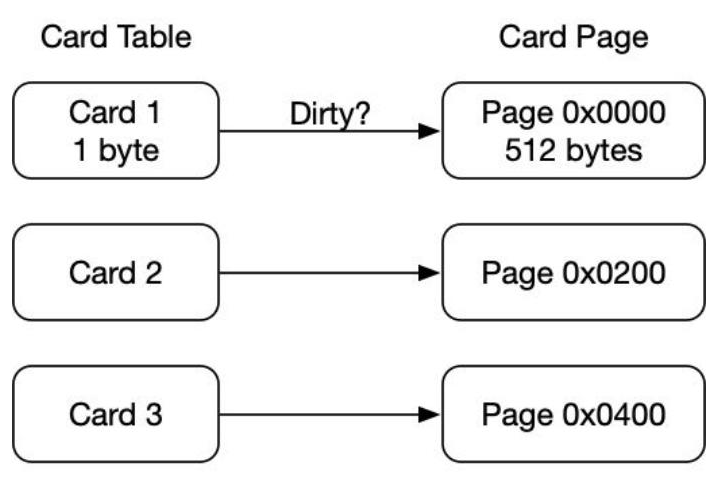   

一个卡页中可包含多个对象，只要有一个对象的字段存在跨代指针，其对应的卡表的元素标识就变成1，表示该元素变脏，否则为0.
GC时，只要筛选本收集区的卡表中变脏的元素加入GCRoots里。

#### 卡表的维护

卡表变脏上面已经说了，但是需要知道如何让卡表变脏，即发生引用字段赋值时，如何更新卡表对应的标识为1。
Hotspot使用写屏障维护卡表状态。

# 常见引用类型

java的引用类型一般分为四种：强引用、软引用、弱引用、虚引用

强引用：普通的变量引用

    public static User user = new User();

软引用：将对象用SoftReference软引用类型的对象包裹，正常情况不会被回收，但是GC做完后发现释放不出空间存放新的对象，
则会把这些软引用的对象回收掉。软引用可用来实现内存敏感的高速缓存。

    public static SoftReference<User> user = new SoftReference<User>(new User());

    软引用在实际中有重要的应用，例如浏览器的后退按钮。按后退时，这个后退时显示的网页内容是重新进行请求还是从缓存中取出呢？
    这就要看具体的实现策略了。

    （1）如果一个网页在浏览结束时就进行内容的回收，则按后退查看前面浏览过的页面时，需要重新构建
    （2）如果将浏览过的网页存储到内存中会造成内存的大量浪费，甚至会造成内存溢出

弱引用：将对象用WeakReference软引用类型的对象包裹，弱引用跟没引用差不多，GC会直接回收掉，很少用

    public static WeakReference<User> user = new WeakReference<User>(new User());

虚引用：虚引用也称为幽灵引用或者幻影引用，它是最弱的一种引用关系，几乎不用

