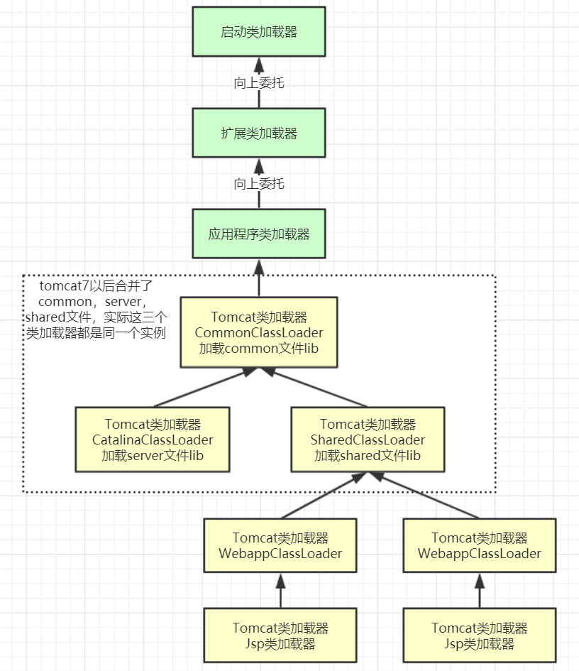

#### 1.Java代码执行流程图
#### 2.类的加载过程
#### 3.类加载器的分类
#### 4.类加载机制-双亲委派机制
#### 5.Tomcat打破双亲委派机制

# 1.Java代码执行流程图

# 2.类的加载过程

第一步：Loading加载

    通过类的全限定名（包名 + 类名），获取到该类的.class文件的二进制字节流
    将二进制字节流所代表的静态存储结构，转化为方法区运行时的数据结构
    
    在内存中生成一个代表该类的java.lang.Class对象，作为方法区这个类的各种数据的访问入口
    
    总结：加载二进制数据到内存 —> 映射成jvm能识别的结构 —> 在内存中生成class文件。

第二步：Linking链接

    链接是指将上面创建好的class类合并至Java虚拟机中，使之能够执行的过程，可分为验证、准备、解析三个阶段。

    ① 验证（Verify）
    
    确保class文件中的字节流包含的信息，符合当前虚拟机的要求，保证这个被加载的class类的正确性，不会危害到虚拟机的安全。

    ② 准备（Prepare）
    
    为类中的静态字段分配内存，并设置默认的初始值，比如int类型初始值是0。被final修饰的static字段不会设置，因为final在编译的时候就分配了

    ③ 解析（Resolve）
    
    解析阶段的目的，是将常量池内的符号引用转换为直接引用的过程（将常量池内的符号引用解析成为实际引用）。
    如果符号引用指向一个未被加载的类，或者未被加载类的字段或方法，那么解析将触发这个类的加载（但未必触发这个类的链接以及初始化。）
    事实上，解析器操作往往会伴随着 JVM 在执行完初始化之后再执行。 符号引用就是一组符号来描述所引用的目标。
    符号引用的字面量形式明确定义在《Java 虚拟机规范》的Class文件格式中。直接引用就是直接指向目标的指针、相对偏移量或一个间接定位到目标的句柄。
    
    解析动作主要针对类、接口、字段、类方法、接口方法、方法类型等。对应常量池中的 CONSTANT_Class_info、
    CONSTANT_Fieldref_info、CONSTANT_Methodref_info等

第三步：initialization初始化

    初始化就是执行类的构造器方法init()的过程。
    这个方法不需要定义，是javac编译器自动收集类中所有类变量的赋值动作和静态代码块中的语句合并来的。
    
    若该类具有父类，jvm会保证父类的init先执行，然后在执行子类的init。

🚀 类被加载到方法区中后主要包含 运行时常量池、类型信息、字段信息、方法信息、类加载器的引用、对应class实例的引用等信息。

🚀 类加载器的引用：这个类到类加载器实例的引用

🚀 对应class实例的引用：类加载器在加载类信息放到方法区中后，会创建一个对应的Class 类型的对象实例放到堆(Heap)中,
   作为开发人员访问方法区中类定义的入口和切入点。

# 3.类加载器的分类

🚀 引导类加载器：负责加载支撑JVM运行的位于JRE的lib目录下的核心类库，比如rt.jar、charsets.jar等

🚀 扩展类加载器：负责加载支撑JVM运行的位于JRE的lib目录下的ext扩展目录中的JAR类包

🚀 应用程序类加载器：负责加载ClassPath路径下的类包，主要就是加载你自己写的那些类

🚀 自定义加载器：负责加载用户自定义路径下的类包

### 自定义加载器实现步骤

      继承java.lang.ClassLoader类，重写findClass()方法

      如果没有太复杂的需求，可以直接继承URLClassLoader类，重写loadClass方法，具体可参考AppClassLoader和ExtClassLoader。

# 4.类加载机制-双亲委派机制

      （1）如果一个类加载器接收到了类加载的请求，它自己不会先去加载，会把这个请求委托给父类加载器去执行。
      
      （2）如果父类还存在父类加载器，则继续向上委托，一直委托到启动类加载器：Bootstrap ClassLoader
      
      （3）如果父类加载器可以完成加载任务，就返回成功结果，如果父类加载失败，就由子类自己去尝试加载，
          如果子类加载失败就会抛出ClassNotFoundException异常，这就是双亲委派模式

### 为什么要设计双亲委派机制？
   
      沙箱安全机制：自己写的java.lang.String.class类不会被加载，这样便可以防止核心API库被随意篡改
      避免类的重复加载：当父亲已经加载了该类时，就没有必要子ClassLoader再加载一次，保证被加载类的唯一性

# 5.Tomcat打破双亲委派机制

以Tomcat类加载为例，Tomcat 如果使用默认的双亲委派类加载机制行不行？

Tomcat是个web容器， 那么它要解决什么问题：

      1. 一个web容器可能需要部署两个应用程序，不同的应用程序可能会依赖同一个第三方类库的不同版本，不能要求同一个类库在同一个服务器只有一份，
         因此要保证每个应用程序的类库都是独立的，保证相互隔离。
      2. 部署在同一个web容器中相同的类库相同的版本可以共享。否则，如果服务器有10个应用程序，那么要有10份相同的类库加载进虚拟机。
      3. web容器也有自己依赖的类库，不能与应用程序的类库混淆。基于安全考虑，应该让容器的类库和程序的类库隔离开来。
      4. web容器要支持jsp的修改，我们知道，jsp 文件最终也是要编译成class文件才能在虚拟机中运行，但程序运行后修改jsp已经是司空见惯的事情，
         web容器需要支持 jsp 修改后不用重启。

再看看我们的问题：Tomcat 如果使用默认的双亲委派类加载机制行不行？

      答案是不行的。为什么？
      
      第一个问题，如果使用默认的类加载器机制，那么是无法加载两个相同类库的不同版本的，默认的类加器是不管你是什么版本的，只在乎你的全限定类名，并且只有一份。
      第二个问题，默认的类加载器是能够实现的，因为他的职责就是保证唯一性。
      第三个问题和第一个问题一样。
      我们再看第四个问题，我们想我们要怎么实现jsp文件的热加载，jsp 文件其实也就是class文件，那么如果修改了，但类名还是一样，
      类加载器会直接取方法区中已经存在的，修改后的jsp是不会重新加载的。那么怎么办呢？我们可以直接卸载掉这jsp文件的类加载器，
      所以你应该想到了，每个jsp文件对应一个唯一的类加载器，当一个jsp文件修改了，就直接卸载这个jsp类加载器。重新创建类加载器，重新加载jsp文件。

tomcat的几个主要类加载器：

      🚀 commonLoader：Tomcat最基本的类加载器，加载路径中的class可以被Tomcat容器本身以及各个Webapp访问
      🚀 catalinaLoader：Tomcat容器私有的类加载器，加载路径中的class对于Webapp不可见
      🚀 sharedLoader：各个Webapp共享的类加载器，加载路径中的class对于所有Webapp可见，但是对于Tomcat容器不可见
      🚀 WebappClassLoader：各个Webapp私有的类加载器，加载路径中的class只对当前Webapp可见，比如加载war包里相关的类，
      每个war包应用都有自己的WebappClassLoader，实现相互隔离，比如不同war包应用引入了不同的spring版本，这样实现就能加载各自的spring版本

从图中的委派关系中可以看出：

      CommonClassLoader能加载的类都可以被CatalinaClassLoader和SharedClassLoader使用，从而实现了公有类库的共用，
      而CatalinaClassLoader和SharedClassLoader自己能加载的类则与对方相互隔离。
      WebAppClassLoader可以使用SharedClassLoader加载到的类，但各个WebAppClassLoader实例之间相互隔离。
      而JasperLoader的加载范围仅仅是这个JSP文件所编译出来的那一个.Class文件，它出现的目的就是为了被丢弃：
      当Web容器检测到JSP文件被修改时，会替换掉目前的JasperLoader的实例，并通过再建立一个新的Jsp类加载器来实现JSP文件的热加载功能。

tomcat 这种类加载机制违背了java 推荐的双亲委派模型了吗？

      答案是：违背了。

      很显然，tomcat 不是这样实现，tomcat 为了实现隔离性，没有遵守这个约定，每个webappClassLoader加载自己的目录下的class文件，
      不会传递给父类加载器，打破了双亲委派机制。

20220701 图灵课堂学习笔记总结

