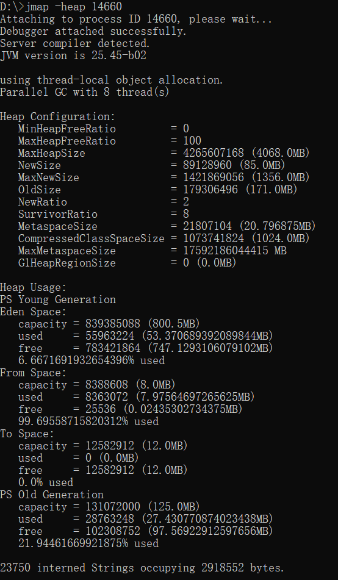
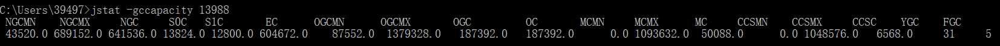
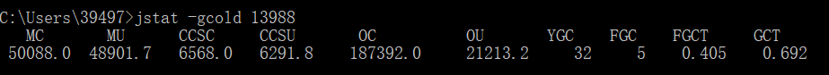

# 1.jps

jps查看其进程id

# 2.jmap

此命令可以用来查看内存信息，实例个数以及占用内存大小

    jmap -histo 14660  #查看历史生成的实例

    jmap -histo:live 14660  #查看当前存活的实例，执行过程中可能会触发一次full gc

    num：序号
    instances：实例数量
    bytes：占用空间大小
    class name：类名称，[C is a char[]，[S is a short[]，[I is a int[]，[B is a byte[]，[[I is a int[][]

堆信息

堆内存dump

    jmap -dump:format=b,file=eureka.hprof 14660

# jstack

用jstack加进程id查找死锁

# jinfo

查看正在运行的Java应用程序的扩展参数

查看jvm的参数

# jstat

jstat命令可以查看堆内存各部分的使用量，以及加载类的数量。命令的格式如下：
jstat [-命令选项] [vmid] [间隔时间(毫秒)] [查询次数]

    jstat -gc pid 最常用，可以评估程序内存使用及GC压力整体情况

    S0C：第一个幸存区的大小，单位KB
    S1C：第二个幸存区的大小
    S0U：第一个幸存区的使用大小
    S1U：第二个幸存区的使用大小
    EC：伊甸园区的大小
    EU：伊甸园区的使用大小
    OC：老年代大小
    OU：老年代使用大小
    MC：方法区大小(元空间)
    MU：方法区使用大小
    CCSC:压缩类空间大小
    CCSU:压缩类空间使用大小
    YGC：年轻代垃圾回收次数
    YGCT：年轻代垃圾回收消耗时间，单位s
    FGC：老年代垃圾回收次数
    FGCT：老年代垃圾回收消耗时间，单位s
    GCT：垃圾回收消耗总时间，单位s

堆内存统计

    NGCMN：新生代最小容量
    NGCMX：新生代最大容量
    NGC：当前新生代容量
    S0C：第一个幸存区大小
    S1C：第二个幸存区的大小
    EC：伊甸园区的大小
    OGCMN：老年代最小容量
    OGCMX：老年代最大容量
    OGC：当前老年代大小
    OC:当前老年代大小
    MCMN:最小元数据容量
    MCMX：最大元数据容量
    MC：当前元数据空间大小
    CCSMN：最小压缩类空间大小
    CCSMX：最大压缩类空间大小
    CCSC：当前压缩类空间大小
    YGC：年轻代gc次数
    FGC：老年代GC次数

新生代垃圾回收统计

    S0C：第一个幸存区的大小
    S1C：第二个幸存区的大小
    S0U：第一个幸存区的使用大小
    S1U：第二个幸存区的使用大小
    TT:对象在新生代存活的次数
    MTT:对象在新生代存活的最大次数
    DSS:期望的幸存区大小
    EC：伊甸园区的大小
    EU：伊甸园区的使用大小
    YGC：年轻代垃圾回收次数
    YGCT：年轻代垃圾回收消耗时间

新生代内存统计

    NGCMN：新生代最小容量
    NGCMX：新生代最大容量
    NGC：当前新生代容量
    S0CMX：最大幸存1区大小
    S0C：当前幸存1区大小
    S1CMX：最大幸存2区大小
    S1C：当前幸存2区大小
    ECMX：最大伊甸园区大小
    EC：当前伊甸园区大小
    YGC：年轻代垃圾回收次数
    FGC：老年代回收次数

老年代垃圾回收统计

    MC：方法区大小
    MU：方法区使用大小
    CCSC:压缩类空间大小
    CCSU:压缩类空间使用大小
    OC：老年代大小
    OU：老年代使用大小
    YGC：年轻代垃圾回收次数
    FGC：老年代垃圾回收次数
    FGCT：老年代垃圾回收消耗时间
    GCT：垃圾回收消耗总时间

老年代内存统计

    
    OGCMN：老年代最小容量
    OGCMX：老年代最大容量
    OGC：当前老年代大小
    OC：老年代大小
    YGC：年轻代垃圾回收次数
    FGC：老年代垃圾回收次数
    FGCT：老年代垃圾回收消耗时间
    GCT：垃圾回收消耗总时间

元数据空间统计

    MCMN:最小元数据容量
    MCMX：最大元数据容量
    MC：当前元数据空间大小
    CCSMN：最小压缩类空间大小
    CCSMX：最大压缩类空间大小
    CCSC：当前压缩类空间大小
    YGC：年轻代垃圾回收次数
    FGC：老年代垃圾回收次数
    FGCT：老年代垃圾回收消耗时间
    GCT：垃圾回收消耗总时间

## full gc比minor gc还多的原因有哪些？

    1、元空间不够导致的多余full gc
    2、显示调用System.gc()造成多余的full gc，
        这种一般线上尽量通过-XX:+DisableExplicitGC参数禁用，
        如果加上了这个JVM启动参数，那么代码中调用System.gc()没有任何效果
    3、老年代空间分配担保机制