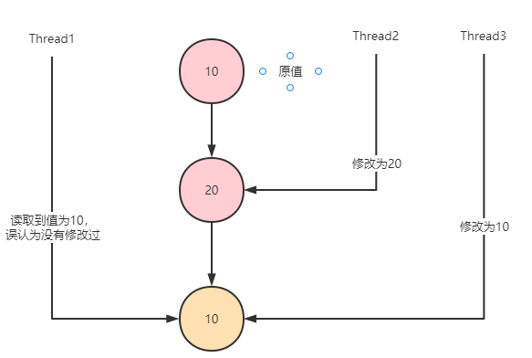
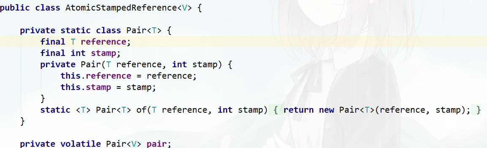
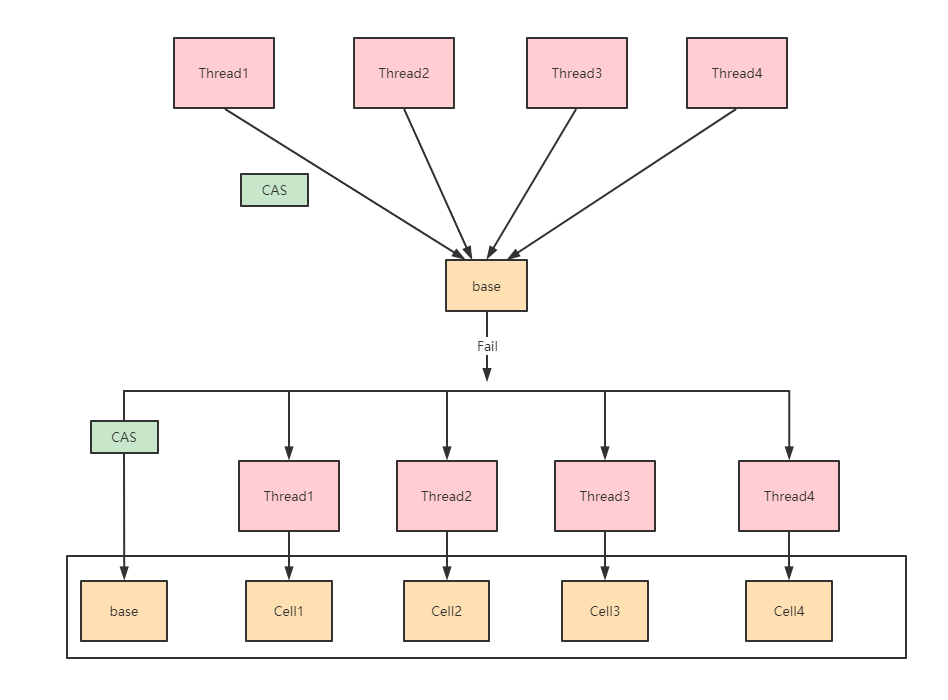
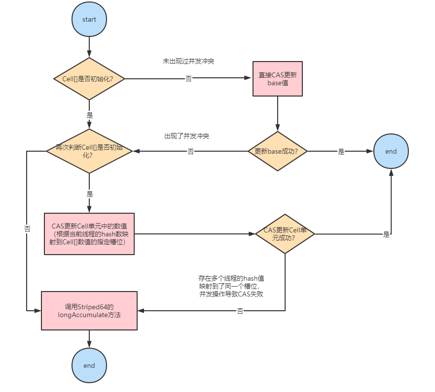
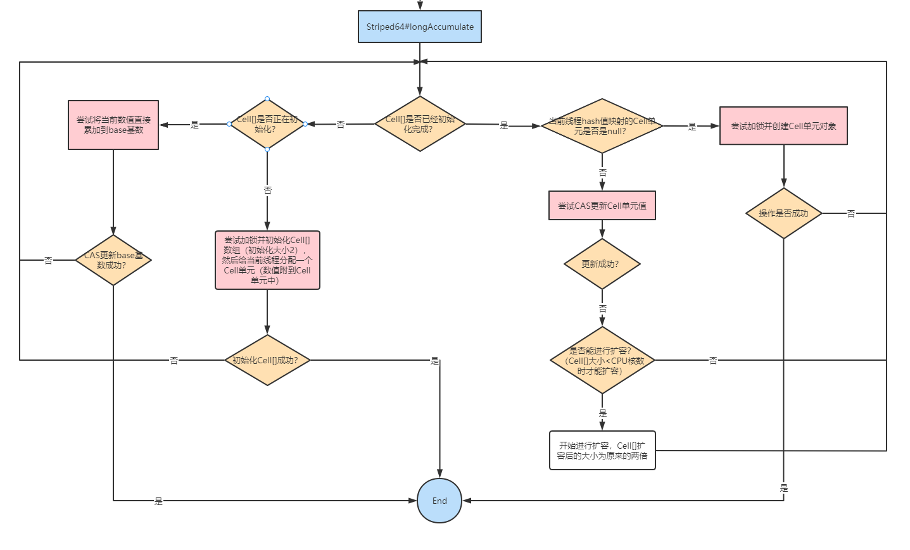

## CAS

CAS（Compare And Swap，比较并交换），通常指的是这样一种原子操作：针对一个变量，
首先比较它的内存值与某个期望值是否相同，如果相同，就给它赋一个新值。

CAS 的逻辑用伪代码描述如下：

```
if (value == expectedValue) {
    value = newValue;
}
```

以上伪代码描述了一个由比较和赋值两阶段组成的复合操作，CAS 可以看作是它们合并后的整体——一个不可分割的原子操作，
并且其原子性是直接在硬件层面得到保障的。

CAS可以看做是乐观锁（对比数据库的悲观、乐观锁）的一种实现方式，Java原子类中的递增操作就通过CAS自旋实现的。

CAS是一种无锁算法，在不使用锁（没有线程被阻塞）的情况下实现多线程之间的变量同步。


### CAS缺陷

CAS 虽然高效地解决了原子操作，但是还是存在一些缺陷的，主要表现在三个方面：

    🚀 自旋 CAS 长时间地不成功，则会给 CPU 带来非常大的开销
    🚀 只能保证一个共享变量原子操作
    🚀 ABA 问题


### ABA问题及其解决方案

    CAS算法实现一个重要前提需要取出内存中某时刻的数据，而在下时刻比较并替换，那么在这个时间差类会导致数据的变化。

#### 什么是ABA问题

    当有多个线程对一个原子类进行操作的时候，某个线程在短时间内将原子类的值A修改为B，又马上将其修改为A，
    此时其他线程不感知，还是会修改成功。




#### ABA问题的解决方案

数据库有个锁称为乐观锁，是一种基于数据版本实现数据同步的机制，每次修改一次数据，版本就会进行累加。
同样，Java也提供了相应的原子引用类AtomicStampedReference<V>



reference即我们实际存储的变量，stamp是版本，每次修改可以通过+1保证版本唯一性。这样就可以保证每次修改后的版本也会往上递增。


## Atomic原子操作类介绍

在并发编程中很容易出现并发安全的问题，有一个很简单的例子就是多线程更新变量i=1,比如多个线程执行i++操作，
就有可能获取不到正确的值，而这个问题，最常用的方法是通过Synchronized进行控制来达到线程安全的目的。

但是由于synchronized是采用的是悲观锁策略，并不是特别高效的一种解决方案。

实际上，在J.U.C下的atomic包提供了一系列的操作简单，性能高效，并能保证线程安全的类去更新基本类型变量，数组元素，
引用类型以及更新对象中的字段类型。atomic包下的这些类都是采用的是乐观锁策略去原子更新数据，在java中则是使用CAS操作具体实现。

在java.util.concurrent.atomic包里提供了一组原子操作类：

    🚀 基本类型：AtomicInteger、AtomicLong、AtomicBoolean；
    🚀 引用类型：AtomicReference、AtomicStampedRerence、AtomicMarkableReference；
    🚀 数组类型：AtomicIntegerArray、AtomicLongArray、AtomicReferenceArray
    🚀 对象属性原子修改器：AtomicIntegerFieldUpdater、AtomicLongFieldUpdater、AtomicReferenceFieldUpdater
    🚀 原子类型累加器（jdk1.8增加的类）：DoubleAccumulator、DoubleAdder、LongAccumulator、LongAdder、Striped64


### LongAdder原理

设计思路

    AtomicLong中有个内部变量value保存着实际的long值，所有的操作都是针对该变量进行。
    也就是说，高并发环境下，value变量其实是一个热点，也就是N个线程竞争一个热点。
    LongAdder的基本思路就是分散热点，将value值分散到一个数组中，不同线程会命中到数组的不同槽中，
    各个线程只对自己槽中的那个值进行CAS操作，这样热点就被分散了，冲突的概率就小很多。
    如果要获取真正的long值，只要将各个槽中的变量值累加返回。 



LongAdder的内部结构

    LongAdder内部有一个base变量，一个Cell[]数组：
    base变量：非竞态条件下，直接累加到该变量上
    Cell[]数组：竞态条件下，累加个各个线程自己的槽Cell[i]中


### LongAdder#add方法

LongAdder#add方法的逻辑如下图：



    只有从未出现过并发冲突的时候，base基数才会使用到，一旦出现了并发冲突，之后所有的操作都只针对Cell[]数组中的单元Cell。
    
    如果Cell[]数组未初始化，会调用父类的longAccumelate去初始化Cell[]，如果Cell[]已经初始化但是冲突发生在Cell单元内，
    则也调用父类的longAccumelate，此时可能就需要对Cell[]扩容了。
    
    这也是LongAdder设计的精妙之处：尽量减少热点冲突，不到最后万不得已，尽量将CAS操作延迟。


### Striped64#longAccumulate方法

整个Striped64#longAccumulate的流程图如下：



