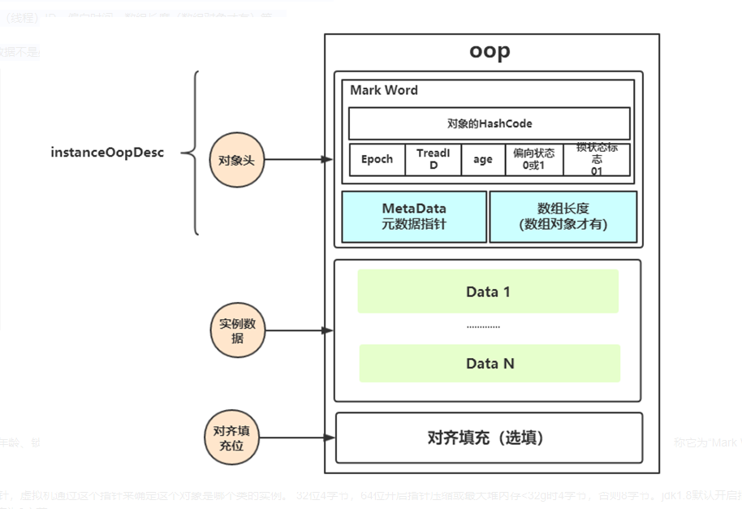
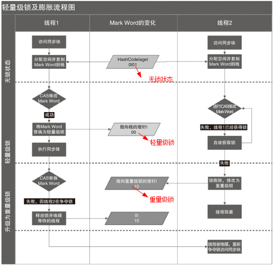

### 临界区（ Critical Section）

    一个程序运行多个线程本身是没有问题的，问题出在多个线程访问共享资源
    多个线程读共享资源其实也没有问题
    在多个线程对共享资源读写操作时发生指令交错，就会出现问题

    一段代码块内如果存在对共享资源的多线程读写操作，称这段代码块为临界区，其共享资源为临界资源

```java

//临界资源
private static int counter = 0;

public static void increment() { //临界区
    counter++;
}

public static void decrement() {//临界区
    counter--;

```


### 竞态条件（ Race Condition ）
    多个线程在临界区内执行，由于代码的执行序列不同而导致结果无法预测，称之为发生了竞态条件

为了避免临界区的竞态条件发生，有多种手段可以达到目的：

    🚀 阻塞式的解决方案：synchronized，Lock
    🚀 非阻塞式的解决方案：原子变量


## synchronized使用

    synchronized 同步块是 Java 提供的一种原子性内置锁，Java 中的每个对象都可以把它当作一个同步锁来使用，
    这些 Java 内置的使用者看不到的锁被称为内置锁，也叫作监视器锁。


synchronized 实际是用对象锁保证了临界区内代码的原子性


## synchronized底层原理

    synchronized是JVM内置锁，基于Monitor机制实现，依赖底层操作系统的互斥原语Mutex（互斥量），它是一个重量级锁，
    性能较低。当然，JVM内置锁在1.5之后版本做了重大的优化，如锁粗化（Lock Coarsening）、锁消除（Lock Elimination）、
    轻量级锁（Lightweight Locking）、偏向锁（Biased Locking）、自适应自旋（Adaptive Spinning）等技术来减少锁操作的开销，
    内置锁的并发性能已经基本与Lock持平。


#### Monitor（管程/监视器）

    Monitor，直译为“监视器”，而操作系统领域一般翻译为“管程”。管程是指管理共享变量以及对共享变量操作的过程，
    让它们支持并发。在Java 1.5之前，Java语言提供的唯一并发语言就是管程，Java 1.5之后提供的SDK并发包也是以管程为基础的。
    除了Java之外，C/C++、C#等高级语言也都是支持管程的。synchronized关键字和wait()、notify()、notifyAll()
    这三个方法是Java中实现管程技术的组成部分

MESA模型

    在管程的发展史上，先后出现过三种不同的管程模型，分别是Hasen模型、Hoare模型和MESA模型。
    现在正在广泛使用的是MESA模型。下面我们便介绍MESA模型：


wait()的正确使用姿势

    对于MESA管程来说，有一个编程范式：
```
while(条件不满足) {
    wait();
}
```
    唤醒的时间和获取到锁继续执行的时间是不一致的，被唤醒的线程再次执行时可能条件又不满足了，
    所以循环检验条件。MESA模型的wait()方法还有一个超时参数，为了避免线程进入等待队列永久阻塞。


notify()和notifyAll()分别何时使用

    满足以下三个条件时，可以使用notify()，其余情况尽量使用notifyAll()：
    🚀 所有等待线程拥有相同的等待条件；
    🚀 所有等待线程被唤醒后，执行相同的操作；
    🚀 只需要唤醒一个线程。


### Java语言的内置管程synchronized


## 对象的内存布局

Hotspot虚拟机中，对象在内存中存储的布局可以分为三块区域：对象头（Header）、实例数据（Instance Data）和对齐填充（Padding）。

    🚀 对象头：比如 hash码，对象所属的年代，对象锁，锁状态标志，偏向锁（线程）ID，偏向时间，数组长度（数组对象才有）等。
    🚀 实例数据：存放类的属性数据信息，包括父类的属性信息；
    🚀 对齐填充：由于虚拟机要求 对象起始地址必须是8字节的整数倍。填充数据不是必须存在的，仅仅是为了字节对齐。



### 对象头详解

Mark Word

    用于存储对象自身的运行时数据，如哈希码（HashCode）、GC分代年龄、锁状态标志、线程持有的锁、偏向线程ID、偏向时间戳等，
    这部分数据的长度在32位和64位的虚拟机中分别为32bit和64bit，官方称它为“Mark Word”

Klass Pointer

    对象头的另外一部分是klass类型指针，即对象指向它的类元数据的指针，虚拟机通过这个指针来确定这个对象是哪个类的实例。
    32位4字节，64位开启指针压缩或最大堆内存<32g时4字节，否则8字节。
    jdk1.8默认开启指针压缩后为4字节，当在JVM参数中关闭指针压缩（-XX:-UseCompressedOops）后，长度为8字节。

数组长度（只有数组对象有）

    如果对象是一个数组, 那在对象头中还必须有一块数据用于记录数组长度。4字节


## JVM中锁的优化


    简单来说在JVM中monitorenter和monitorexit字节码依赖于底层的操作系统的Mutex Lock来实现的，
    但是由于使用Mutex Lock需要将当前线程挂起并从用户态切换到内核态来执行，这种切换的代价是非常昂贵的；
    然而在现实中的大部分情况下，同步方法是运行在单线程环境(无锁竞争环境)如果每次都调用Mutex Lock那么将严重的影响程序的性能。
    不过在jdk1.6中对锁的实现引入了大量的优化，如锁粗化(Lock Coarsening)、锁消除(Lock Elimination)、轻量级锁(Lightweight Locking)、
    偏向锁(Biased Locking)、适应性自旋(Adaptive Spinning)等技术来减少锁操作的开销。 

    🚀 锁粗化(Lock Coarsening)：也就是减少不必要的紧连在一起的unlock，lock操作，将多个连续的锁扩展成一个范围更大的锁。 
    
    🚀 锁消除(Lock Elimination)：通过运行时JIT编译器的逃逸分析来消除一些没有在当前同步块以外被其他线程共享的数据的锁保护，
    通过逃逸分析也可以在线程本的Stack上进行对象空间的分配(同时还可以减少Heap上的垃圾收集开销)。 
    
    🚀 轻量级锁(Lightweight Locking)：这种锁实现的背后基于这样一种假设，即在真实的情况下我们程序中的大部分同步代码一般
    都处于无锁竞争状态(即单线程执行环境)，在无锁竞争的情况下完全可以避免调用操作系统层面的重量级互斥锁，
    取而代之的是在monitorenter和monitorexit中只需要依靠一条CAS原子指令就可以完成锁的获取及释放。
    当存在锁竞争的情况下，执行CAS指令失败的线程将调用操作系统互斥锁进入到阻塞状态，当锁被释放的时候被唤醒(具体处理步骤下面详细讨论)。
    
    🚀 偏向锁(Biased Locking)：是为了在无锁竞争的情况下避免在锁获取过程中执行不必要的CAS原子指令，
    因为CAS原子指令虽然相对于重量级锁来说开销比较小但还是存在非常可观的本地延迟。 
    
    🚀 适应性自旋(Adaptive Spinning)：当线程在获取轻量级锁的过程中执行CAS操作失败时，
    在进入与monitor相关联的操作系统重量级锁(mutex semaphore)前会进入忙等待(Spinning)然后再次尝试，
    当尝试一定的次数后如果仍然没有成功则调用与该monitor关联的semaphore(即互斥锁)进入到阻塞状态。


## 锁的类型


    在Java SE 1.6里Synchronied同步锁，一共有四种状态：无锁、偏向锁、轻量级锁、重量级锁，它会随着竞争情况逐渐升级。
    锁可以升级但是不可以降级，目的是为了提供获取锁和释放锁的效率。

#### 自旋锁


    自旋锁早在JDK1.4 中就引入了，只是当时默认时关闭的。在JDK 1.6后默认为开启状态。
    自旋锁本质上与阻塞并不相同，先不考虑其对多处理器的要求，如果锁占用的时间非常的短，那么自旋锁的性能会非常的好，
    相反，其会带来更多的性能开销(因为在线程自旋时，始终会占用CPU的时间片，如果锁占用的时间太长，那么自旋的线程会白白消耗掉CPU资源)。
    因此自旋等待的时间必须要有一定的限度，如果自旋超过了限定的次数仍然没有成功获取到锁，就应该使用传统的方式去挂起线程了，
    在JDK定义中，自旋锁默认的自旋次数为10次，用户可以使用参数-XX:PreBlockSpin来更改。 
    
    可是现在又出现了一个问题：如果线程锁在线程自旋刚结束就释放掉了锁，那么是不是有点得不偿失。
    所以这时候我们需要更加聪明的锁来实现更加灵活的自旋。来提高并发的性能。(这里则需要自适应自旋锁！)


#### 自适应自旋锁


    在JDK 1.6中引入了自适应自旋锁。这就意味着自旋的时间不再固定了，而是由前一次在同一个锁上的自旋 
    时间及锁的拥有者的状态来决定的。如果在同一个锁对象上，自旋等待刚刚成功获取过锁，并且持有锁的线程正在运行中，
    那么JVM会认为该锁自旋获取到锁的可能性很大，会自动增加等待时间。比如增加到100此循环。
    相反，如果对于某个锁，自旋很少成功获取锁。那再以后要获取这个锁时将可能省略掉自旋过程，以避免浪费处理器资源。
    有了自适应自旋，JVM对程序的锁的状态预测会越来越准确，JVM也会越来越聪明。

#### 锁消除


    
    锁消除是指虚拟机即时编译器再运行时，对一些代码上要求同步，但是被检测到不可能存在共享数据竞争的锁进行消除。
    锁消除的主要判定依据来源于逃逸分析的数据支持。意思就是：JVM会判断再一段程序中的同步明显不会逃逸出去从而被其他线程访问到，
    那JVM就把它们当作栈上数据对待，认为这些数据是线程独有的，不需要加同步。此时就会进行锁消除。 
    当然在实际开发中，我们很清楚的知道哪些是线程独有的，不需要加同步锁，但是在Java API中有很多方法都是加了同步的，
    那么此时JVM会判断这段代码是否需要加锁。如果数据并不会逃逸，则会进行锁消除。比如如下操作：在操作String类型数据时，
    由于String是一个不可变类，对字符串的连接操作总是通过生成的新的String对象来进行的。
    因此Javac编译器会对String连接做自动优化。在JDK 1.5之前会使用StringBuffer对象的连续append()操作，
    在JDK 1.5及以后的版本中，会转化为StringBuidler对象的连续append()操作。


#### 锁粗化


    原则上，我们都知道在加同步锁时，尽可能的将同步块的作用范围限制到尽量小的范围(只在共享数据的实际作用域中才进行同步，
    这样是为了使得需要同步的操作数量尽可能变小。在存在锁同步竞争中，也可以使得等待锁的线程尽早的拿到锁)。 
    大部分上述情况是完美正确的，但是如果存在连串的一系列操作都对同一个对象反复加锁和解锁，
    甚至加锁操作时出现在循环体中的，那即使没有线程竞争，频繁的进行互斥同步操作也会导致不必要的性能操作。


#### 轻量级锁


    在JDK 1.6之后引入的轻量级锁，需要注意的是轻量级锁并不是替代重量级锁的，而是对在大多数情况下同步块并不会有竞争出现提出的一种优化。
    它可以减少重量级锁对线程的阻塞带来的线程开销。从而提高并发性能。 如果要理解轻量级锁，
    那么必须先要了解HotSpot虚拟机中对象头的内存布局。上面介绍Java对象头也详细介绍过。
    在对象头中(Object Header)存在两部分。第一部分用于存储对象自身的运行时数据，HashCode、GC Age、锁标记位、是否为偏向锁等。
    一般为32位或者64位(视操作系统位数定)。官方称之为Mark Word，它是实现轻量级锁和偏向锁的关键。 
    另外一部分存储的是指向方法区对象类型数据的指针(Klass Point)，如果对象是数组的话，还会有一个额外的部分用于存储数据的长度。


轻量级锁加锁


    在线程执行同步块之前，JVM会先在当前线程的栈帧中创建一个名为锁记录(Lock Record)的空间，
    用于存储锁对象目前的Mark Word的拷贝(JVM会将对象头中的Mark Word拷贝到锁记录中，官方称为Displaced Mark Ward)
    这个时候线程堆栈与对象头的状态如图：


    如上图所示：如果当前对象没有被锁定，那么锁标志位为01状态，JVM在执行当前线程时，
    首先会在当前线程栈帧中创建锁记录Lock Record的空间用于存储锁对象目前的Mark Word的拷贝。 
    然后，虚拟机使用CAS操作将标记字段Mark Word拷贝到锁记录中，并且将Mark Word更新为指向Lock Record的指针。
    如果更新成功了，那么这个线程就有用了该对象的锁，并且对象Mark Word的锁标志位更新为(Mark Word中最后的2bit)00，
    即表示此对象处于轻量级锁定状态，如图：


    如果这个更新操作失败，JVM会检查当前的Mark Word中是否存在指向当前线程的栈帧的指针，
    如果有，说明该锁已经被获取，可以直接调用。如果没有，则说明该锁被其他线程抢占了，
    如果有两条以上的线程竞争同一个锁，那轻量级锁就不再有效，直接膨胀位重量级锁，
    没有获得锁的线程会被阻塞。此时，锁的标志位为10.Mark Word中存储的时指向重量级锁的指针。 
    
    轻量级解锁时，会使用原子的CAS操作将Displaced Mark Word替换回到对象头中，如果成功，
    则表示没有发生竞争关系。如果失败，表示当前锁存在竞争关系。锁就会膨胀成重量级锁。
    两个线程同时争夺锁，导致锁膨胀的流程图如下：




#### 偏向锁


    引入背景：
    在大多实际环境下，锁不仅不存在多线程竞争，而且总是由同一个线程多次获取，那么在同一个线程反复获取所释放锁中，
    其中并还没有锁的竞争，那么这样看上去，多次的获取锁和释放锁带来了很多不必要的性能开销和上下文切换。


    为了解决这一问题，HotSpot的作者在Java SE 1.6 中对Synchronized进行了优化，引入了偏向锁。
    当一个线程访问同步块并获取锁时，会在对象头和栈帧中的锁记录里存储锁偏向的线程ID，以后该线程在进入和推出同步块时
    不需要进行CAS操作来加锁和解锁。只需要简单的测试一下对象头的Mark Word里是否存储着指向当前线程的偏向锁。如果成功，表示线程已经获取到了锁。


偏向锁的撤销

    偏向锁使用了一种等待竞争出现才会释放锁的机制。所以当其他线程尝试获取偏向锁时，持有偏向锁的线程才会释放锁。
    但是偏向锁的撤销需要等到全局安全点(就是当前线程没有正在执行的字节码)。它会首先暂停拥有偏向锁的线程，
    让你后检查持有偏向锁的线程是否活着。如果线程不处于活动状态，直接将对象头设置为无锁状态。
    如果线程活着，JVM会遍历栈帧中的锁记录，栈帧中的锁记录和对象头要么偏向于其他线程，要么恢复到无锁状态或者标记对象不适合作为偏向锁。


### 锁的优缺点对比


使用Synchronized有哪些要注意的？ 

    🚀 锁对象不能为空，因为锁的信息都保存在对象头里 
    🚀 作用域不宜过大，影响程序执行的速度，控制范围过大，编写代码也容易出错 
    🚀 避免死锁 
    🚀 在能选择的情况下，既不要用Lock也不要用synchronized关键字，用java.util.concurrent包中的各种各样的类，
    如果不用该包下的类，在满足业务的情况下，可以使用synchronized关键，因为代码量少，避免出错

synchronized是公平锁吗？

    synchronized实际上是非公平的，新来的线程有可能立即获得监视器，而在等待区中等候已久的线程可能再次等待，
    这样有利于提高性能，但是也可能会导致饥饿现象


