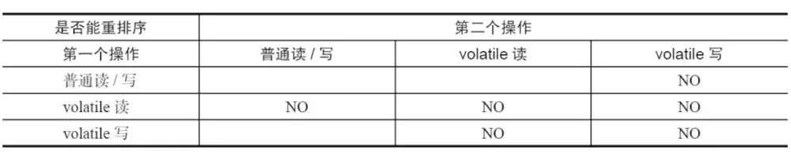

# 1.volatile的作用详解

    防重排序
    实现可见性
    保证原子性:单次读/写

# 2.volatile 的实现原理

    内存屏障，又称内存栅栏，是一个 CPU 指令。 

    在程序运行时，为了提高执行性能，编译器和处理器会对指令进行重排序，JMM 为了保证在不同的编译器和 
    CPU 上有相同的结果，通过插入特定类型的内存屏障来禁止特定类型的编译器重排序和处理器重排序，
    插入一条内存屏障会告诉编译器和CPU：不管什么指令都不能和这条 Memory Barrier 指令重排序。

# 3.volatile 有序性实现

volatile 的 happens-before 关系 

    happens-before 规则中有一条是 volatile 变量规则:
    对一个 volatile 域的写，happens-before 于任意后续对这个 volatile 域的读。

volatile 禁止重排序

    为了性能优化，JMM 在不改变正确语义的前提下，会允许编译器和处理器对指令序列进行重排序。
    JMM 提供了内存屏障阻止这种重排序。 
    Java 编译器会在生成指令系列时在适当的位置会插入内存屏障指令来禁止特定类型的处理器重排序。
    JMM 会针对编译器制定 volatile 重排序规则表。

