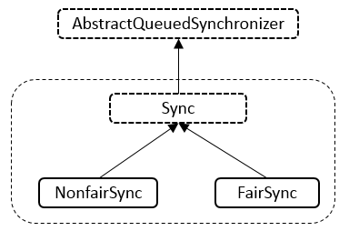

## 什么是AQS

    java.util.concurrent包中的大多数同步器实现都是围绕着共同的基础行为，比如等待队列、条件队列、独占获取、共享获取等，
    而这些行为的抽象就是基于AbstractQueuedSynchronizer（简称AQS）实现的，AQS是一个抽象同步框架，可以用来实现一个依赖状态的同步器。

JDK中提供的大多数的同步器如Lock, Latch, Barrier等，都是基于AQS框架来实现的

    一般是通过一个内部类Sync继承 AQS
    将同步器所有调用都映射到Sync对应的方法

AQS具备的特性：

    🚀 阻塞等待队列
    🚀 共享/独占
    🚀 公平/非公平
    🚀 可重入
    🚀 允许中断

AQS内部维护属性

    volatile int state

    state表示资源的可用状态

State三种访问方式：

    🚀 getState()
    🚀 setState()
    🚀 compareAndSetState()

AQS定义两种资源共享方式

    🚀 Exclusive-独占，只有一个线程能执行，如ReentrantLock
    🚀 Share-共享，多个线程可以同时执行，如Semaphore/CountDownLatch

AQS定义两种队列

    🚀 同步等待队列： 主要用于维护获取锁失败时入队的线程
    🚀 条件等待队列： 调用await()的时候会释放锁，然后线程会加入到条件队列，
    调用signal()唤醒的时候会把条件队列中的线程节点移动到同步队列中，等待再次获得锁

AQS 定义了5个队列中节点状态：

    🚀 值为0，初始化状态，表示当前节点在sync队列中，等待着获取锁。
    🚀 CANCELLED，值为1，表示当前的线程被取消；
    🚀 SIGNAL，值为-1，表示当前节点的后继节点包含的线程需要运行，也就是unpark；
    🚀 CONDITION，值为-2，表示当前节点在等待condition，也就是在condition队列中；
    🚀 PROPAGATE，值为-3，表示当前场景下后续的acquireShared能够得以执行；

不同的自定义同步器竞争共享资源的方式也不同。自定义同步器在实现时只需要实现共享资源state的获取与释放方式即可，
至于具体线程等待队列的维护（如获取资源失败入队/唤醒出队等），AQS已经在顶层实现好了。

自定义同步器实现时主要实现以下几种方法：

    🚀 isHeldExclusively()：该线程是否正在独占资源。只有用到condition才需要去实现它。
    🚀 tryAcquire(int)：独占方式。尝试获取资源，成功则返回true，失败则返回false。
    🚀 tryRelease(int)：独占方式。尝试释放资源，成功则返回true，失败则返回false。
    🚀 tryAcquireShared(int)：共享方式。尝试获取资源。负数表示失败；0表示成功，但没有剩余可用资源；正数表示成功，且有剩余资源。
    🚀 tryReleaseShared(int)：共享方式。尝试释放资源，如果释放后允许唤醒后续等待结点返回true，否则返回false。

同步等待队列

    AQS当中的同步等待队列也称CLH队列，CLH队列是Craig、Landin、Hagersten三人发明的一种基于双向链表数据结构的队列，
    是FIFO先进先出线程等待队列，Java中的CLH队列是原CLH队列的一个变种,线程由原自旋机制改为阻塞机制。

AQS 依赖CLH同步队列来完成同步状态的管理：

    当前线程如果获取同步状态失败时，AQS则会将当前线程已经等待状态等信息构造成一个节点（Node）并将其加入到CLH同步队列，
    同时会阻塞当前线程
    当同步状态释放时，会把首节点唤醒（公平锁），使其再次尝试获取同步状态。
    通过signal或signalAll将条件队列中的节点转移到同步队列。（由条件队列转化为同步队列）

#### 条件等待队列

    AQS中条件队列是使用单向列表保存的，用nextWaiter来连接:
    调用await方法阻塞线程；
    当前线程存在于同步队列的头结点，调用await方法进行阻塞（从同步队列转化到条件队列）

#### Condition接口详解

    调用Condition#await方法会释放当前持有的锁，然后阻塞当前线程，同时向Condition队列尾部添加一个节点，
    所以调用Condition#await方法的时候必须持有锁。

    调用Condition#signal方法会将Condition队列的首节点移动到阻塞队列尾部，然后唤醒因调用Condition#await方法而阻塞的
    线程(唤醒之后这个线程就可以去竞争锁了)，所以调用Condition#signal方法的时候必须持有锁，持有锁的线程唤醒被因调用
    Condition#await方法而阻塞的线程。

### ReentrantLock详解

    ReentrantLock是一种基于AQS框架的应用实现，是JDK中的一种线程并发访问的同步手段，
    它的功能类似于synchronized是一种互斥锁，可以保证线程安全。

相对于 synchronized， ReentrantLock具备如下特点：

    🚀 可中断
    🚀 可以设置超时时间
    🚀 可以设置为公平锁
    🚀 支持多个条件变量
    🚀 与 synchronized 一样，都支持可重入

顺便总结了几点synchronized和ReentrantLock的区别：

    🚀 synchronized是JVM层次的锁实现，ReentrantLock是JDK层次的锁实现；
    🚀 synchronized的锁状态是无法在代码中直接判断的，但是ReentrantLock可以通过ReentrantLock#isLocked判断；
    🚀 synchronized是非公平锁，ReentrantLock是可以是公平也可以是非公平的；
    🚀 synchronized是不可以被中断的，而ReentrantLock#lockInterruptibly方法是可以被中断的；
    🚀 在发生异常时synchronized会自动释放锁，而ReentrantLock需要开发者在finally块中显示释放锁；
    🚀 ReentrantLock获取锁的形式有多种：如立即返回是否成功的tryLock(),以及等待指定时长的获取，更加灵活；
    🚀 synchronized在特定的情况下对于已经在等待的线程是后来的线程先获得锁（回顾一下sychronized的唤醒策略），
    而ReentrantLock对于已经在等待的线程是先来的线程先获得锁；

