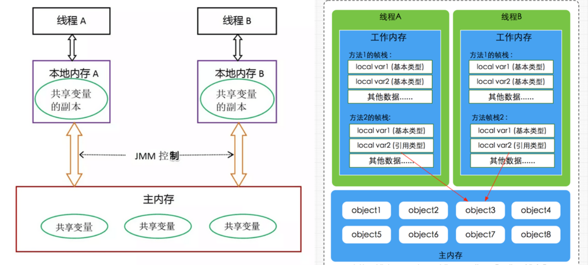

# 并发三要素

### 可见性: CPU缓存引起

可见性：一个线程对共享变量的修改，另外一个线程能够立刻看到。

### 原子性: 分时复用引起

原子性：即一个操作或者多个操作 要么全部执行并且执行的过程不会被任何因素打断，要么就都不执行。

### 有序性: 重排序引起

有序性：即程序执行的顺序按照代码的先后顺序执行。

在执行程序时为了提高性能，编译器和处理器常常会对指令做重排序。重排序分三种类型：

    🚀 编译器优化的重排序。编译器在不改变单线程程序语义的前提下，可以重新安排语句的执行顺序。

    🚀 指令级并行的重排序。现代处理器采用了指令级并行技术（Instruction-Level Parallelism， ILP）
    来将多条指令重叠执行。如果不存在数据依赖性，处理器可以改变语句对应机器指令的执行顺序。 
    
    🚀 内存系统的重排序。由于处理器使用缓存和读 / 写缓冲区，这使得加载和存储操作看上去可能是在乱序执行。 

从 java 源代码到最终实际执行的指令序列，会分别经历下面三种重排序：

# JAVA内存模型

### 内存交互操作

    🚀 lock（锁定）：作用于主内存的变量，把一个变量标识为一条线程独占状态。
    🚀 unlock（解锁）：作用于主内存变量，把一个处于锁定状态的变量释放出来，释放后的变量才可以被其他线程锁定。
    🚀 read（读取）：作用于主内存变量，把一个变量值从主内存传输到线程的工作内存中，以便随后的load动作使用
    🚀 load（载入）：作用于工作内存的变量，它把read操作从主内存中得到的变量值放入工作内存的变量副本中。
    🚀 use（使用）：作用于工作内存的变量，把工作内存中的一个变量值传递给执行引擎，每当虚拟机遇到一个需要使用变量的值的字节码指令时将会执行这个操作。
    🚀 assign（赋值）：作用于工作内存的变量，它把一个从执行引擎接收到的值赋值给工作内存的变量，每当虚拟机遇到一个给变量赋值的字节码指令时执行这个操作。
    🚀 store（存储）：作用于工作内存的变量，把工作内存中的一个变量的值传送到主内存中，以便随后的write的操作。
    🚀 write（写入）：作用于主内存的变量，它把store操作从工作内存中一个变量的值传送到主内存的变量中。

