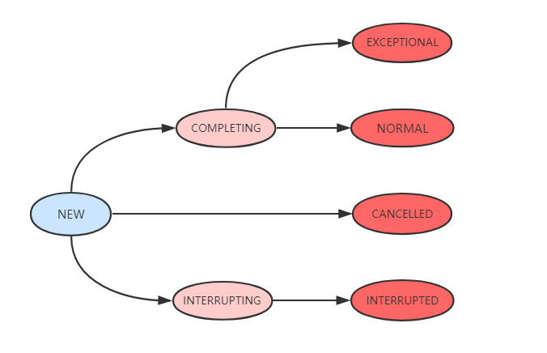

# FutureTask简介


FutureTask 为 Future 提供了基础实现，如获取任务执行结果(get)和取消任务(cancel)等。
如果任务尚未完成，获取任务执行结果时将会阻塞。一旦执行结束，任务就不能被重启或取消(除非使用runAndReset执行计算)。
FutureTask 常用来封装 Callable 和 Runnable，也可以作为一个任务提交到线程池中执行。除了作为一个独立的类之外，
此类也提供了一些功能性函数供我们创建自定义 task 类使用。FutureTask 的线程安全由CAS来保证。


#### FutureTask类关系


可以看到,FutureTask实现了RunnableFuture接口，则RunnableFuture接口继承了Runnable接口和Future接口，
所以FutureTask既能当做一个Runnable直接被Thread执行，也能作为Future用来得到Callable的计算结果。


## FutureTask源码解析

Callable接口

    Callable是个泛型接口，泛型V就是要call()方法返回的类型。对比Runnable接口，Runnable不会返回数据也不能抛出异常。

```java

public interface Callable<V> {
    /**
     * Computes a result, or throws an exception if unable to do so.
     *
     * @return computed result
     * @throws Exception if unable to compute a result
     */
    V call() throws Exception;
}


```

Future接口

    Future接口代表异步计算的结果，通过Future接口提供的方法可以查看异步计算是否执行完成，或者等待执行结果并获取执行结果，
    同时还可以取消执行。Future接口的定义如下:

```java

public interface Future<V> {
    boolean cancel(boolean mayInterruptIfRunning);
    boolean isCancelled();
    boolean isDone();
    V get() throws InterruptedException, ExecutionException;
    V get(long timeout, TimeUnit unit)
        throws InterruptedException, ExecutionException, TimeoutException;
}


```


    🚀 cancel():cancel()方法用来取消异步任务的执行。如果异步任务已经完成或者已经被取消，或者由于某些原因不能取消，则会返回false。
    如果任务还没有被执行，则会返回true并且异步任务不会被执行。如果任务已经开始执行了但是还没有执行完成，
    若mayInterruptIfRunning为true，则会立即中断执行任务的线程并返回true，若mayInterruptIfRunning为false，
    则会返回true且不会中断任务执行线程。 
    
    🚀 isCanceled():判断任务是否被取消，如果任务在结束(正常执行结束或者执行异常结束)前被取消则返回true，否则返回false。 
    
    🚀 isDone():判断任务是否已经完成，如果完成则返回true，否则返回false。需要注意的是：任务执行过程中发生异常、
    任务被取消也属于任务已完成，也会返回true。 
    
    🚀 get():获取任务执行结果，如果任务还没完成则会阻塞等待直到任务执行完成。如果任务被取消则会抛出CancellationException异常，
    如果任务执行过程发生异常则会抛出ExecutionException异常，如果阻塞等待过程中被中断则会抛出InterruptedException异常。
    
    🚀 get(long timeout,Timeunit unit):带超时时间的get()版本，如果阻塞等待过程中超时则会抛出TimeoutException异常。


### 核心属性

```java


//内部持有的callable任务，运行完毕后置空
private Callable<V> callable;

//从get()中返回的结果或抛出的异常
private Object outcome; // non-volatile, protected by state reads/writes

//运行callable的线程
private volatile Thread runner;

//使用Treiber栈保存等待线程
private volatile WaitNode waiters;

//任务状态
private volatile int state;
private static final int NEW          = 0;
private static final int COMPLETING   = 1;
private static final int NORMAL       = 2;
private static final int EXCEPTIONAL  = 3;
private static final int CANCELLED    = 4;
private static final int INTERRUPTING = 5;
private static final int INTERRUPTED  = 6;


```


其中需要注意的是state是volatile类型的，也就是说只要有任何一个线程修改了这个变量，那么其他所有的线程都会知道最新的值。

7种状态具体表示： 

    🚀 NEW:表示是个新的任务或者还没被执行完的任务。这是初始状态。
    
    🚀 COMPLETING:任务已经执行完成或者执行任务的时候发生异常，但是任务执行结果或者异常原因还没有保存到outcome字段
    (outcome字段用来保存任务执行结果，如果发生异常，则用来保存异常原因)的时候，状态会从NEW变更到COMPLETING。
    但是这个状态会时间会比较短，属于中间状态。 

    🚀 NORMAL:任务已经执行完成并且任务执行结果已经保存到outcome字段，状态会从COMPLETING转换到NORMAL。这是一个最终态。 
    
    🚀 EXCEPTIONAL:任务执行发生异常并且异常原因已经保存到outcome字段中后，状态会从COMPLETING转换到EXCEPTIONAL。这是一个最终态。
    
    🚀 CANCELLED:任务还没开始执行或者已经开始执行但是还没有执行完成的时候，用户调用了cancel(false)方法取消任务且不中断任务执行线程，
    这个时候状态会从NEW转化为CANCELLED状态。这是一个最终态。 
    
    🚀 INTERRUPTING: 任务还没开始执行或者已经执行但是还没有执行完成的时候，用户调用了cancel(true)方法取消任务并且要
    中断任务执行线程但是还没有中断任务执行线程之前，状态会从NEW转化为INTERRUPTING。这是一个中间状态。 
    
    🚀 INTERRUPTED:调用interrupt()中断任务执行线程之后状态会从INTERRUPTING转换到INTERRUPTED。这是一个最终态。
    有一点需要注意的是，所有值大于COMPLETING的状态都表示任务已经执行完成(任务正常执行完成，任务执行异常或者任务被取消)。


各个状态之间的可能转换关系如下图所示:





#### 构造函数

FutureTask(Callable<V> callable)

```java

public FutureTask(Callable<V> callable) {
    if (callable == null)
        throw new NullPointerException();
    this.callable = callable;
    this.state = NEW;       // ensure visibility of callable
}


```


    
    这个构造函数会把传入的Callable变量保存在this.callable字段中，该字段定义为private Callable<V> callable;
    用来保存底层的调用，在被执行完成以后会指向null,接着会初始化state字段为NEW。


FutureTask(Runnable runnable, V result)


```java
public FutureTask(Runnable runnable, V result) {
    this.callable = Executors.callable(runnable, result);
    this.state = NEW;       // ensure visibility of callable
}


```


    这个构造函数会把传入的Runnable封装成一个Callable对象保存在callable字段中，同时如果任务执行成功的话就
    会返回传入的result。这种情况下如果不需要返回值的话可以传入一个null。 顺带看下Executors.callable()这个方法，
    这个方法的功能是把Runnable转换成Callable，代码如下:

```java

public static <T> Callable<T> callable(Runnable task, T result) {
    if (task == null)
       throw new NullPointerException();
    return new RunnableAdapter<T>(task, result);
}


```

可以看到这里采用的是适配器模式，调用RunnableAdapter<T>(task, result)方法来适配，实现如下:

```java

static final class RunnableAdapter<T> implements Callable<T> {
    final Runnable task;
    final T result;
    RunnableAdapter(Runnable task, T result) {
        this.task = task;
        this.result = result;
    }
    public T call() {
        task.run();
        return result;
    }
}


```


这个适配器很简单，就是简单的实现了Callable接口，在call()实现中调用Runnable.run()方法，
然后把传入的result作为任务的结果返回。 在new了一个FutureTask对象之后，接下来就是在另一个
线程中执行这个Task,无论是通过直接new一个Thread还是通过线程池，执行的都是run()方法，接下来就看看run()方法的实现。


### 核心方法 - run()

```java

public void run() {
    //新建任务，CAS替换runner为当前线程
    if (state != NEW ||
        !UNSAFE.compareAndSwapObject(this, runnerOffset,
                                     null, Thread.currentThread()))
        return;
    try {
        Callable<V> c = callable;
        if (c != null && state == NEW) {
            V result;
            boolean ran;
            try {
                result = c.call();
                ran = true;
            } catch (Throwable ex) {
                result = null;
                ran = false;
                setException(ex);
            }
            if (ran)
                set(result);//设置执行结果
        }
    } finally {
        // runner must be non-null until state is settled to
        // prevent concurrent calls to run()
        runner = null;
        // state must be re-read after nulling runner to prevent
        // leaked interrupts
        int s = state;
        if (s >= INTERRUPTING)
            handlePossibleCancellationInterrupt(s);//处理中断逻辑
    }
}


```

说明：

运行任务，如果任务状态为NEW状态，则利用CAS修改为当前线程。执行完毕调用set(result)方法设置执行结果。set(result)源码如下：


```java

protected void set(V v) {
    if (UNSAFE.compareAndSwapInt(this, stateOffset, NEW, COMPLETING)) {
        outcome = v;
        UNSAFE.putOrderedInt(this, stateOffset, NORMAL); // final state
        finishCompletion();//执行完毕，唤醒等待线程
    }
}

```


首先利用cas修改state状态为COMPLETING，设置返回结果，然后使用 lazySet(UNSAFE.putOrderedInt)的方式
设置state状态为NORMAL。结果设置完毕后，调用finishCompletion()方法唤醒等待线程，源码如下：


```java
private void finishCompletion() {
    // assert state > COMPLETING;
    for (WaitNode q; (q = waiters) != null;) {
        if (UNSAFE.compareAndSwapObject(this, waitersOffset, q, null)) {//移除等待线程
            for (;;) {//自旋遍历等待线程
                Thread t = q.thread;
                if (t != null) {
                    q.thread = null;
                    LockSupport.unpark(t);//唤醒等待线程
                }
                WaitNode next = q.next;
                if (next == null)
                    break;
                q.next = null; // unlink to help gc
                q = next;
            }
            break;
        }
    }
    //任务完成后调用函数，自定义扩展
    done();

    callable = null;        // to reduce footprint
}


```


回到run方法，如果在 run 期间被中断，此时需要调用handlePossibleCancellationInterrupt方法来处理中断逻辑，
确保任何中断(例如cancel(true))只停留在当前run或runAndReset的任务中，源码如下：

```java
private void handlePossibleCancellationInterrupt(int s) {
    //在中断者中断线程之前可能会延迟，所以我们只需要让出CPU时间片自旋等待
    if (s == INTERRUPTING)
        while (state == INTERRUPTING)
            Thread.yield(); // wait out pending interrupt
}


```


### 核心方法 - get()

```java
//获取执行结果
public V get() throws InterruptedException, ExecutionException {
    int s = state;
    if (s <= COMPLETING)
        s = awaitDone(false, 0L);
    return report(s);
}


```


说明：FutureTask 通过get()方法获取任务执行结果。如果任务处于未完成的状态(state <= COMPLETING)，
就调用awaitDone方法(后面单独讲解)等待任务完成。任务完成后，通过report方法获取执行结果或抛出执行期间的异常。
report源码如下：

```java
//返回执行结果或抛出异常
private V report(int s) throws ExecutionException {
    Object x = outcome;
    if (s == NORMAL)
        return (V)x;
    if (s >= CANCELLED)
        throw new CancellationException();
    throw new ExecutionException((Throwable)x);
}


```

### 核心方法 - awaitDone(boolean timed, long nanos)


```java

private int awaitDone(boolean timed, long nanos)
    throws InterruptedException {
    final long deadline = timed ? System.nanoTime() + nanos : 0L;
    WaitNode q = null;
    boolean queued = false;
    for (;;) {//自旋
        if (Thread.interrupted()) {//获取并清除中断状态
            removeWaiter(q);//移除等待WaitNode
            throw new InterruptedException();
        }

        int s = state;
        if (s > COMPLETING) {
            if (q != null)
                q.thread = null;//置空等待节点的线程
            return s;
        }
        else if (s == COMPLETING) // cannot time out yet
            Thread.yield();
        else if (q == null)
            q = new WaitNode();
        else if (!queued)
            //CAS修改waiter
            queued = UNSAFE.compareAndSwapObject(this, waitersOffset,
                                                 q.next = waiters, q);
        else if (timed) {
            nanos = deadline - System.nanoTime();
            if (nanos <= 0L) {
                removeWaiter(q);//超时，移除等待节点
                return state;
            }
            LockSupport.parkNanos(this, nanos);//阻塞当前线程
        }
        else
            LockSupport.park(this);//阻塞当前线程
    }
}


```


说明：awaitDone用于等待任务完成，或任务因为中断或超时而终止。返回任务的完成状态。函数执行逻辑如下：
如果线程被中断，首先清除中断状态，调用removeWaiter移除等待节点，然后抛出InterruptedException。removeWaiter源码如下：


```java

private void removeWaiter(WaitNode node) {
    if (node != null) {
        node.thread = null;//首先置空线程
        retry:
        for (;;) {          // restart on removeWaiter race
            //依次遍历查找
            for (WaitNode pred = null, q = waiters, s; q != null; q = s) {
                s = q.next;
                if (q.thread != null)
                    pred = q;
                else if (pred != null) {
                    pred.next = s;
                    if (pred.thread == null) // check for race
                        continue retry;
                }
                else if (!UNSAFE.compareAndSwapObject(this, waitersOffset,q, s)) //cas替换
                    continue retry;
            }
            break;
        }
    }
}


```


    如果当前状态为结束状态(state>COMPLETING),则根据需要置空等待节点的线程，并返回 Future 状态； 
    如果当前状态为正在完成(COMPLETING)，说明此时 Future 还不能做出超时动作，为任务让出CPU执行时间片； 
    如果state为NEW，先新建一个WaitNode，然后CAS修改当前waiters； 
    如果等待超时，则调用removeWaiter移除等待节点，返回任务状态；
    如果设置了超时时间但是尚未超时，则park阻塞当前线程； 其他情况直接阻塞当前线程。


### 核心方法 - cancel(boolean mayInterruptIfRunning)


```java

public boolean cancel(boolean mayInterruptIfRunning) {
    //如果当前Future状态为NEW，根据参数修改Future状态为INTERRUPTING或CANCELLED
    if (!(state == NEW &&
          UNSAFE.compareAndSwapInt(this, stateOffset, NEW,
              mayInterruptIfRunning ? INTERRUPTING : CANCELLED)))
        return false;
    try {    // in case call to interrupt throws exception
        if (mayInterruptIfRunning) {//可以在运行时中断
            try {
                Thread t = runner;
                if (t != null)
                    t.interrupt();
            } finally { // final state
                UNSAFE.putOrderedInt(this, stateOffset, INTERRUPTED);
            }
        }
    } finally {
        finishCompletion();//移除并唤醒所有等待线程
    }
    return true;
}


```


说明：尝试取消任务。如果任务已经完成或已经被取消，此操作会失败。 

    如果当前Future状态为NEW，根据参数修改Future状态为INTERRUPTING或CANCELLED。 
    如果当前状态不为NEW，则根据参数mayInterruptIfRunning决定是否在任务运行中也可以中断。
    中断操作完成后，调用finishCompletion移除并唤醒所有等待线程。


### FutureTask示例 


常用使用方式： 

    第一种方式: Future + ExecutorService 
    第二种方式: FutureTask + ExecutorService 
    第三种方式: FutureTask + Thread 


Future使用示例

```java

public class FutureDemo {
      public static void main(String[] args) {
          ExecutorService executorService = Executors.newCachedThreadPool();
          Future future = executorService.submit(new Callable<Object>() {
              @Override
              public Object call() throws Exception {
                  Long start = System.currentTimeMillis();
                  while (true) {
                      Long current = System.currentTimeMillis();
                     if ((current - start) > 1000) {
                         return 1;
                     }
                 }
             }
         });
  
         try {
             Integer result = (Integer)future.get();
             System.out.println(result);
         }catch (Exception e){
             e.printStackTrace();
         }
     }
}


```

FutureTask+Thread例子

```java

import java.util.concurrent.*;
 
public class CallDemo {
 
    public static void main(String[] args) throws ExecutionException, InterruptedException {
 
        /**
         * 第一种方式:Future + ExecutorService
         * Task task = new Task();
         * ExecutorService service = Executors.newCachedThreadPool();
         * Future<Integer> future = service.submit(task1);
         * service.shutdown();
         */
 
 
        /**
         * 第二种方式: FutureTask + ExecutorService
         * ExecutorService executor = Executors.newCachedThreadPool();
         * Task task = new Task();
         * FutureTask<Integer> futureTask = new FutureTask<Integer>(task);
         * executor.submit(futureTask);
         * executor.shutdown();
         */
 
        /**
         * 第三种方式:FutureTask + Thread
         */
 
        // 2. 新建FutureTask,需要一个实现了Callable接口的类的实例作为构造函数参数
        FutureTask<Integer> futureTask = new FutureTask<Integer>(new Task());
        // 3. 新建Thread对象并启动
        Thread thread = new Thread(futureTask);
        thread.setName("Task thread");
        thread.start();
 
        try {
            Thread.sleep(1000);
        } catch (InterruptedException e) {
            e.printStackTrace();
        }
 
        System.out.println("Thread [" + Thread.currentThread().getName() + "] is running");
 
        // 4. 调用isDone()判断任务是否结束
        if(!futureTask.isDone()) {
            System.out.println("Task is not done");
            try {
                Thread.sleep(2000);
            } catch (InterruptedException e) {
                e.printStackTrace();
            }
        }
        int result = 0;
        try {
            // 5. 调用get()方法获取任务结果,如果任务没有执行完成则阻塞等待
            result = futureTask.get();
        } catch (Exception e) {
            e.printStackTrace();
        }
 
        System.out.println("result is " + result);
 
    }
 
    // 1. 继承Callable接口,实现call()方法,泛型参数为要返回的类型
    static class Task  implements Callable<Integer> {
 
        @Override
        public Integer call() throws Exception {
            System.out.println("Thread [" + Thread.currentThread().getName() + "] is running");
            int result = 0;
            for(int i = 0; i < 100;++i) {
                result += i;
            }
 
            Thread.sleep(3000);
            return result;
        }
    }
}


```


