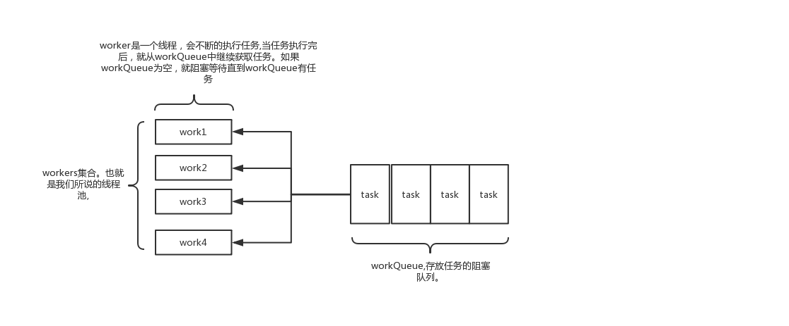

### 为什么要有线程池

 线程池能够对线程进行统一分配，调优和监控:

    🚀 降低资源消耗(线程无限制地创建，然后使用完毕后销毁)
    🚀 提高响应速度(无须创建线程)
    🚀 提高线程的可管理性


## ThreadPoolExecutor使用详解 

    其实java线程池的实现原理很简单，说白了就是一个线程集合workerSet和一个阻塞队列workQueue。
    当用户向线程池提交一个任务(也就是线程)时，线程池会先将任务放入workQueue中。
    workerSet中的线程会不断的从workQueue中获取线程然后执行。当workQueue中没有任务的时候，worker就会阻塞，
    直到队列中有任务了就取出来继续执行。




## Execute原理 

    当一个任务提交至线程池之后: 线程池首先当前运行的线程数量是否少于corePoolSize。
    如果是，则创建一个新的工作线程来执行任务。如果都在执行任务，则进入2. 
    判断BlockingQueue是否已经满了，倘若还没有满，则将线程放入BlockingQueue。
    否则进入3. 如果创建一个新的工作线程将使当前运行的线程数量超过maximumPoolSize，
    则交给RejectedExecutionHandler来处理任务。 当ThreadPoolExecutor创建新线程时，通过CAS来更新线程池的状态ctl


```java

public ThreadPoolExecutor(int corePoolSize,
                              int maximumPoolSize,
                              long keepAliveTime,
                              TimeUnit unit,
                              BlockingQueue<Runnable> workQueue,
                              RejectedExecutionHandler handler)

```


corePoolSize

    线程池中的核心线程数，当提交一个任务时，线程池创建一个新线程执行任务，直到当前线程数等于corePoolSize, 
    即使有其他空闲线程能够执行新来的任务, 也会继续创建线程；如果当前线程数为corePoolSize，继续提交的任务
    被保存到阻塞队列中，等待被执行；如果执行了线程池的prestartAllCoreThreads()方法，线程池会提前创建并
    启动所有核心线程。 

workQueue

    用来保存等待被执行的任务的阻塞队列. 
    
    在JDK中提供了如下阻塞队列: 

    🚀 BlockQueue详解 ArrayBlockingQueue: 基于数组结构的有界阻塞队列，按FIFO排序任务；
    🚀 LinkedBlockingQueue: 基于链表结构的阻塞队列，按FIFO排序任务，吞吐量通常要高于ArrayBlockingQueue； 
    🚀 SynchronousQueue: 一个不存储元素的阻塞队列，每个插入操作必须等到另一个线程调用移除操作，否则插入操作一直处于阻塞状态，
    吞吐量通常要高于LinkedBlockingQueue； 
    🚀 PriorityBlockingQueue: 具有优先级的无界阻塞队列； 


    LinkedBlockingQueue比ArrayBlockingQueue在插入删除节点性能方面更优，但是二者在put(), 
    take()任务的时均需要加锁，SynchronousQueue使用无锁算法，根据节点的状态判断执行，而不需要用到锁，
    其核心是Transfer.transfer(). 

maximumPoolSize

    线程池中允许的最大线程数。如果当前阻塞队列满了，且继续提交任务，则创建新的线程执行任务，
    前提是当前线程数小于maximumPoolSize；当阻塞队列是无界队列, 则maximumPoolSize则不起作用,
    因为无法提交至核心线程池的线程会一直持续地放入workQueue. 


keepAliveTime

    线程空闲时的存活时间，即当线程没有任务执行时，该线程继续存活的时间；默认情况下，
    该参数只在线程数大于corePoolSize时才有用, 超过这个时间的空闲线程将被终止； 

unit

    keepAliveTime的单位 

threadFactory

    创建线程的工厂，通过自定义的线程工厂可以给每个新建的线程设置一个具有识别度的线程名。
    默认为DefaultThreadFactory handler 线程池的饱和策略，当阻塞队列满了，且没有空闲的工作线程，
    如果继续提交任务，必须采取一种策略处理该任务，
    线程池提供了4种策略: 

    🚀 AbortPolicy: 直接抛出异常，默认策略； 
    🚀 CallerRunsPolicy: 用调用者所在的线程来执行任务；
    🚀 DiscardOldestPolicy: 丢弃阻塞队列中靠最前的任务，并执行当前任务； 
    🚀 DiscardPolicy: 直接丢弃任务； 


    当然也可以根据应用场景实现RejectedExecutionHandler接口，自定义饱和策略，如记录日志或持久化存储不能处理的任务。


## 三种类型

newFixedThreadPool

```java

public static ExecutorService newFixedThreadPool(int nThreads) {
    return new ThreadPoolExecutor(nThreads, nThreads,
                                0L, TimeUnit.MILLISECONDS,
                                new LinkedBlockingQueue<Runnable>());
}


```


    线程池的线程数量达corePoolSize后，即使线程池没有可执行任务时，也不会释放线程。 
    
    FixedThreadPool的工作队列为无界队列LinkedBlockingQueue(队列容量为Integer.MAX_VALUE), 
    
    这会导致以下问题: 

    🚀 线程池里的线程数量不超过corePoolSize,这导致了maximumPoolSize和keepAliveTime 将会是个无用参数 
    🚀 由于使用了无界队列, 所以FixedThreadPool永远不会拒绝, 即饱和策略失效


newSingleThreadExecutor


```java

public static ExecutorService newSingleThreadExecutor() {
    return new FinalizableDelegatedExecutorService
        (new ThreadPoolExecutor(1, 1,
                                0L, TimeUnit.MILLISECONDS,
                                new LinkedBlockingQueue<Runnable>()));
}


```


    初始化的线程池中只有一个线程，如果该线程异常结束，会重新创建一个新的线程继续执行任务，唯一的线程可以保证所提交任务的顺序执行.
    
    由于使用了无界队列, 所以SingleThreadPool永远不会拒绝, 即饱和策略失效

newCachedThreadPool


```java

public static ExecutorService newCachedThreadPool() {
    return new ThreadPoolExecutor(0, Integer.MAX_VALUE,
                                    60L, TimeUnit.SECONDS,
                                    new SynchronousQueue<Runnable>());
}


```


    线程池的线程数可达到Integer.MAX_VALUE，即2147483647，内部使用SynchronousQueue作为阻塞队列；
    和newFixedThreadPool创建的线程池不同，newCachedThreadPool在没有任务执行时，当线程的空闲时间超过keepAliveTime，
    会自动释放线程资源，当提交新任务时，如果没有空闲线程，则创建新线程执行任务，会导致一定的系统开销；

    执行过程与前两种稍微不同: 

    🚀 主线程调用SynchronousQueue的offer()方法放入task, 倘若此时线程池中有空闲的线程尝试读取 

    SynchronousQueue的task, 即调用了SynchronousQueue的poll(), 那么主线程将该task交给空闲线程. 否则执行(2) 

    🚀 当线程池为空或者没有空闲的线程, 则创建新的线程执行任务

    🚀 执行完任务的线程倘若在60s内仍空闲, 则会被终止.因此长时间空闲的CachedThreadPool不会持有任何线程资源


### 关闭线程池 

遍历线程池中的所有线程，然后逐个调用线程的interrupt方法来中断线程.

####关闭方式 - shutdown 

将线程池里的线程状态设置成SHUTDOWN状态, 然后中断所有没有正在执行任务的线程. 

#### 关闭方式 - shutdownNow 

将线程池里的线程状态设置成STOP状态, 然后停止所有正在执行或暂停任务的线程.

只要调用这两个关闭方法中的任意一个, isShutDown() 返回true.

当所有任务都成功关闭了, isTerminated()返回true


