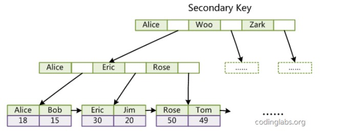

## MySQL存储引擎

    InnoDB 是 MySQL 默认的事务型存储引擎，只有在需要它不支持的特性时，才考虑使用其它存储引擎。 
    实现了四个标准的隔离级别，默认级别是可重复读(REPEATABLE READ)。在可重复读隔离级别下，通过多版本并发控制(MVCC)+ 
    间隙锁(Next-Key Locking)防止幻影读。 
    主索引是聚簇索引，在索引中保存了数据，从而避免直接读取磁盘，因此对查询性能有很大的提升。 
    内部做了很多优化，包括从磁盘读取数据时采用的可预测性读、能够加快读操作并且自动创建的自适应哈希索引、能够加速插入操作的插入缓冲区等。 
    支持真正的在线热备份。其它存储引擎不支持在线热备份，要获取一致性视图需要停止对所有表的写入，而在读写混合场景中，停止写入可能也意味着停止读取。

## 索引（B+树）

#### B+ Tree 原理

数据结构

    B Tree 指的是 Balance Tree，也就是平衡树。平衡树是一颗查找树，并且所有叶子节点位于同一层。 
    B+ Tree 是基于 B Tree 和叶子节点顺序访问指针进行实现，它具有 B Tree 的平衡性，并且通过顺序访问指针来提高区间查询的性能。 
    在 B+ Tree 中，一个节点中的 key 从左到右非递减排列，如果某个指针的左右相邻 key 分别是 keyi 和 keyi+1，且不为 null，
    则该指针指向节点的所有 key 大于等于 keyi 且小于等于 keyi+1。

    进行查找操作时，首先在根节点进行二分查找，找到一个 key 所在的指针，然后递归地在指针所指向的节点进行查找。
    直到查找到叶子节点，然后在叶子节点上进行二分查找，找出 key 所对应的 data。 插入删除操作记录会破坏平衡树的平衡性，
    因此在插入删除操作之后，需要对树进行一个分裂、合并、旋转等操作来维护平衡性。

#### MySQL 索引 

    索引是在存储引擎层实现的，而不是在服务器层实现的，所以不同存储引擎具有不同的索引类型和实现。 
    
    B+Tree 索引 是大多数 MySQL 存储引擎的默认索引类型。 因为不再需要进行全表扫描，只需要对树进行搜索即可，
    因此查找速度快很多。除了用于查找，还可以用于排序和分组。 可以指定多个列作为索引列，多个索引列共同组成键。 
    适用于全键值、键值范围和键前缀查找，其中键前缀查找只适用于最左前缀查找。如果不是按照索引列的顺序进行查找，
    则无法使用索引。 InnoDB 的 B+Tree 索引分为主索引和辅助索引。 主索引的叶子节点 data 域记录着完整的数据记录，
    这种索引方式被称为聚簇索引。因为无法把数据行存放在两个不同的地方，所以一个表只能有一个聚簇索引。

    辅助索引的叶子节点的 data 域记录着主键的值，因此在使用辅助索引进行查找时，需要先查找到主键值，然后再到主索引中进行查找。

### 索引的优点 

    大大减少了服务器需要扫描的数据行数。 
    帮助服务器避免进行排序和分组，也就不需要创建临时表(B+Tree 索引是有序的，可以用于 ORDER BY 和 GROUP BY 操作。
    临时表主要是在排序和分组过程中创建，因为不需要排序和分组，也就不需要创建临时表)。 
    将随机 I/O 变为顺序 I/O(B+Tree 索引是有序的，也就将相邻的数据都存储在一起)。

### 索引的使用场景 

    对于非常小的表、大部分情况下简单的全表扫描比建立索引更高效。 
    对于中到大型的表，索引就非常有效。 但是对于特大型的表，建立和维护索引的代价将会随之增长。
    这种情况下，需要用到一种技术可以直接区分出需要查询的一组数据，而不是一条记录一条记录地匹配，例如可以使用分区技术。

