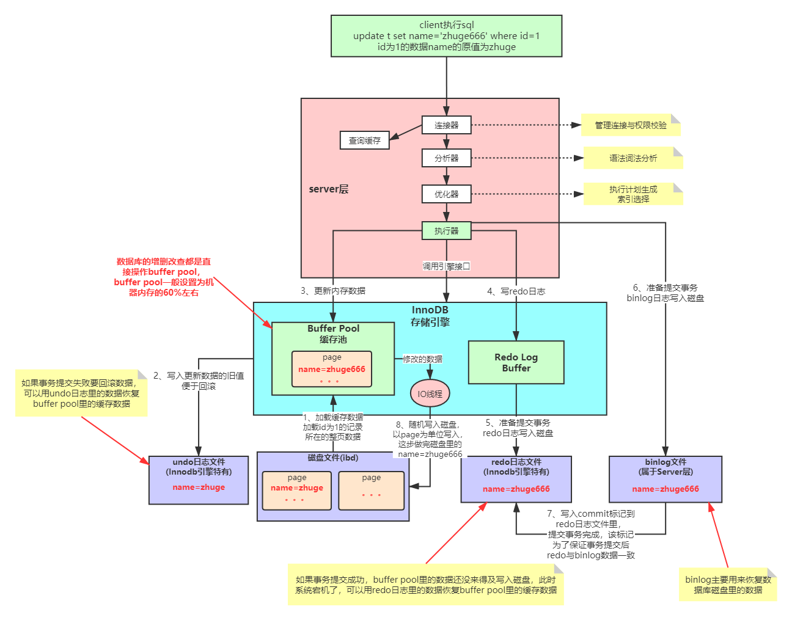

## MySQL的内部组件结构


### Server层

主要包括连接器、查询缓存、分析器、优化器、执行器等，涵盖 MySQL 的大多数核心服务功能，
以及所有的内置函数（如日期、时间、数学和加密函数等），所有跨存储引擎的功能都在这一层实现，比如存储过程、触发器、视图等。

### Store层

存储引擎层负责数据的存储和提取。其架构模式是插件式的，支持 InnoDB、MyISAM、Memory 等多个存储引擎。
现在最常用的存储引擎是 InnoDB，它从 MySQL 5.5.5 版本开始成为了默认存储引擎。
也就是说如果我们在create table时不指定表的存储引擎类型,默认会给你设置存储引擎为InnoDB。

连接器

我们知道由于MySQL是开源的，他有非常多种类的客户端：navicat,mysql front,jdbc,SQLyog等非常丰富的客户端,
这些客户端要向mysql发起通信都必须先跟Server端建立通信连接，而建立连接的工作就是有连接器完成的。

第一步，你会先连接到这个数据库上，这时候接待你的就是连接器。连接器负责跟客户端建立连接、获取权限、维持和管理连接。连接命令一般是这么写的：
```java
[root@192 ~]# mysql -h host[数据库地址] -u root[用户] -p root[密码] -P 3306

```
连接命令中的 mysql 是客户端工具，用来跟服务端建立连接。在完成经典的 TCP 握手后，连接器就要开始认证你的身份，这个时候用的就是你输入的用户名和密码。

    1、如果用户名或密码不对，你就会收到一个"Access denied for user"的错误，然后客户端程序结束执行。
    2、如果用户名密码认证通过，连接器会到权限表里面查出你拥有的权限。之后，这个连接里面的权限判断逻辑，都将依赖于此时读到的权限


### 分析器

    如果没有命中查询缓存，就要开始真正执行语句了。首先，MySQL 需要知道你要做什么，因此需要对 SQL 语句做解析。
    如果没有命中查询缓存，就要开始真正执行语句了。首先，MySQL 需要知道你要做什么，因此需要对 SQL 语句做解析。
    分析器先会做“词法分析”。你输入的是由多个字符串和空格组成的一条 SQL 语句，MySQL 需要识别出里面的字符串分别是什么，代表什么。
    MySQL 从你输入的"select"这个关键字识别出来，这是一个查询语句。它也要把字符串“T”识别成“表名 T”，把字符串“ID”识别成“列 ID”。
    做完了这些识别以后，就要做“语法分析”。根据词法分析的结果，语法分析器会根据语法规则，判断你输入的这个 SQL 语句是否满足 MySQL 语法。
    如果你的语句不对，就会收到“You have an error in your SQL syntax”的错误提醒

#### 词法分析器原理

词法分析器分成6个主要步骤完成对sql语句的分析

    1、词法分析
    2、语法分析
    3、语义分析
    4、构造执行树
    5、生成执行计划
    6、计划的执行


### 优化器

经过了分析器，MySQL 就知道你要做什么了。在开始执行之前，还要先经过优化器的处理。
优化器是在表里面有多个索引的时候，决定使用哪个索引；或者在一个语句有多表关联（join）的时候，
决定各个表的连接顺序。比如你执行下面这样的语句，这个语句是执行两个表的 join：

```java
mysql> select * from test1 join test2 using(ID) where test1.name=yangguo and test2.name=xiaolongnv;

```

    既可以先从表 test1 里面取出 name=yangguo的记录的 ID 值，再根据 ID 值关联到表 test2，再判断 test2 里面 name的值是否等于 yangguo。
    也可以先从表 test2 里面取出 name=xiaolongnv 的记录的 ID 值，再根据 ID 值关联到 test1，再判断 test1 里面 name 的值是否等于 yangguo。
    这两种执行方法的逻辑结果是一样的，但是执行的效率会有不同，而优化器的作用就是决定选择使用哪一个方案。优化器阶段完成后，这个语句的执行方案就确定下来了，
    然后进入执行器阶段。如果你还有一些疑问，比如优化器是怎么选择索引的，有没有可能选择错等等。


### 执行器

开始执行的时候，要先判断一下你对这个表 T 有没有执行查询的权限，如果没有，就会返回没有权限的错误，
如下所示 (在工程实现上，如果命中查询缓存，会在查询缓存返回结果的时候，做权限验证。查询也会在优化器之前调用 precheck 验证权限)。

```java
mysql> select * from test where id=1;

```

如果有权限，就打开表继续执行。打开表的时候，执行器就会根据表的引擎定义，去使用这个引擎提供的接口。
比如我们这个例子中的表 test 中，ID 字段没有索引，那么执行器的执行流程是这样的：
    
    调用 InnoDB 引擎接口取这个表的第一行，判断 ID 值是不是 10，如果不是则跳过，如果是则将这行存在结果集中；
    调用引擎接口取“下一行”，重复相同的判断逻辑，直到取到这个表的最后一行。
    执行器将上述遍历过程中所有满足条件的行组成的记录集作为结果集返回给客户端。

至此，这个语句就执行完成了。对于有索引的表，执行的逻辑也差不多。第一次调用的是“取满足条件的第一行”这个接口，之后循环取“满足条件的下一行”这个接口，
这些接口都是引擎中已经定义好的。你会在数据库的慢查询日志中看到一个 rows_examined 的字段，表示这个语句执行过程中扫描了多少行。
这个值就是在执行器每次调用引擎获取数据行的时候累加的。在有些场景下，执行器调用一次，在引擎内部则扫描了多行，
因此引擎扫描行数跟 rows_examined 并不是完全相同的。





