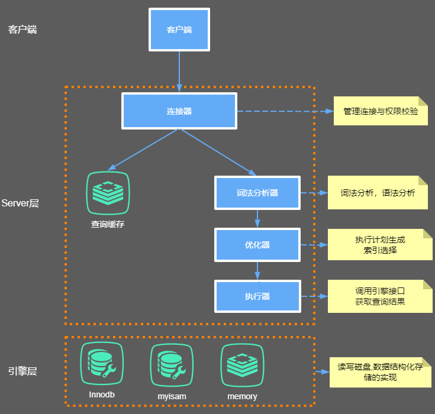
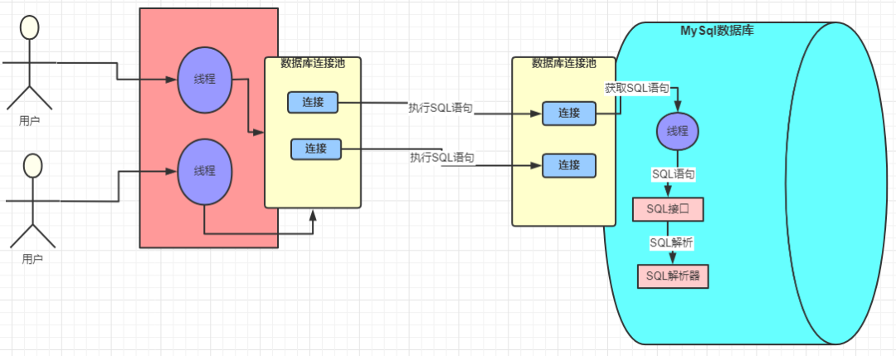
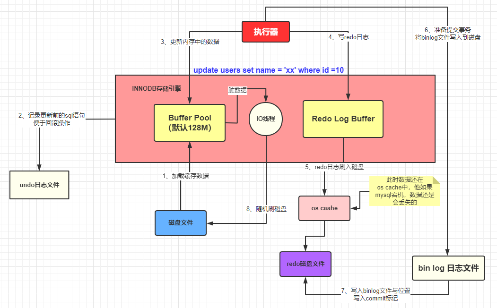

## MySQL的内部组件结构



### Server层

主要包括连接器、查询缓存、分析器、优化器、执行器等，涵盖 MySQL 的大多数核心服务功能，
以及所有的内置函数（如日期、时间、数学和加密函数等），所有跨存储引擎的功能都在这一层实现，比如存储过程、触发器、视图等。

### Store层

存储引擎层负责数据的存储和提取。其架构模式是插件式的，支持 InnoDB、MyISAM、Memory 等多个存储引擎。
现在最常用的存储引擎是 InnoDB，它从 MySQL 5.5.5 版本开始成为了默认存储引擎。
也就是说如果我们在create table时不指定表的存储引擎类型,默认会给你设置存储引擎为InnoDB。

连接器

我们知道由于MySQL是开源的，他有非常多种类的客户端：navicat,mysql front,jdbc,SQLyog等非常丰富的客户端,
这些客户端要向mysql发起通信都必须先跟Server端建立通信连接，而建立连接的工作就是有连接器完成的。

第一步，你会先连接到这个数据库上，这时候接待你的就是连接器。连接器负责跟客户端建立连接、获取权限、维持和管理连接。连接命令一般是这么写的：
```java
[root@192 ~]# mysql -h host[数据库地址] -u root[用户] -p root[密码] -P 3306

```
连接命令中的 mysql 是客户端工具，用来跟服务端建立连接。在完成经典的 TCP 握手后，连接器就要开始认证你的身份，这个时候用的就是你输入的用户名和密码。

    1、如果用户名或密码不对，你就会收到一个"Access denied for user"的错误，然后客户端程序结束执行。
    2、如果用户名密码认证通过，连接器会到权限表里面查出你拥有的权限。之后，这个连接里面的权限判断逻辑，都将依赖于此时读到的权限


### 分析器

    如果没有命中查询缓存，就要开始真正执行语句了。首先，MySQL 需要知道你要做什么，因此需要对 SQL 语句做解析。
    如果没有命中查询缓存，就要开始真正执行语句了。首先，MySQL 需要知道你要做什么，因此需要对 SQL 语句做解析。
    分析器先会做“词法分析”。你输入的是由多个字符串和空格组成的一条 SQL 语句，MySQL 需要识别出里面的字符串分别是什么，代表什么。
    MySQL 从你输入的"select"这个关键字识别出来，这是一个查询语句。它也要把字符串“T”识别成“表名 T”，把字符串“ID”识别成“列 ID”。
    做完了这些识别以后，就要做“语法分析”。根据词法分析的结果，语法分析器会根据语法规则，判断你输入的这个 SQL 语句是否满足 MySQL 语法。
    如果你的语句不对，就会收到“You have an error in your SQL syntax”的错误提醒

#### 词法分析器原理

词法分析器分成6个主要步骤完成对sql语句的分析

    1、词法分析
    2、语法分析
    3、语义分析
    4、构造执行树
    5、生成执行计划
    6、计划的执行


### 优化器

经过了分析器，MySQL 就知道你要做什么了。在开始执行之前，还要先经过优化器的处理。
优化器是在表里面有多个索引的时候，决定使用哪个索引；或者在一个语句有多表关联（join）的时候，
决定各个表的连接顺序。比如你执行下面这样的语句，这个语句是执行两个表的 join：

```java
mysql> select * from test1 join test2 using(ID) where test1.name=yangguo and test2.name=xiaolongnv;

```

    既可以先从表 test1 里面取出 name=yangguo的记录的 ID 值，再根据 ID 值关联到表 test2，再判断 test2 里面 name的值是否等于 yangguo。
    也可以先从表 test2 里面取出 name=xiaolongnv 的记录的 ID 值，再根据 ID 值关联到 test1，再判断 test1 里面 name 的值是否等于 yangguo。
    这两种执行方法的逻辑结果是一样的，但是执行的效率会有不同，而优化器的作用就是决定选择使用哪一个方案。优化器阶段完成后，这个语句的执行方案就确定下来了，
    然后进入执行器阶段。如果你还有一些疑问，比如优化器是怎么选择索引的，有没有可能选择错等等。


### 执行器

开始执行的时候，要先判断一下你对这个表 T 有没有执行查询的权限，如果没有，就会返回没有权限的错误，
如下所示 (在工程实现上，如果命中查询缓存，会在查询缓存返回结果的时候，做权限验证。查询也会在优化器之前调用 precheck 验证权限)。

```java
mysql> select * from test where id=1;

```

如果有权限，就打开表继续执行。打开表的时候，执行器就会根据表的引擎定义，去使用这个引擎提供的接口。
比如我们这个例子中的表 test 中，ID 字段没有索引，那么执行器的执行流程是这样的：
    
    调用 InnoDB 引擎接口取这个表的第一行，判断 ID 值是不是 10，如果不是则跳过，如果是则将这行存在结果集中；
    调用引擎接口取“下一行”，重复相同的判断逻辑，直到取到这个表的最后一行。
    执行器将上述遍历过程中所有满足条件的行组成的记录集作为结果集返回给客户端。

至此，这个语句就执行完成了。对于有索引的表，执行的逻辑也差不多。第一次调用的是“取满足条件的第一行”这个接口，之后循环取“满足条件的下一行”这个接口，
这些接口都是引擎中已经定义好的。你会在数据库的慢查询日志中看到一个 rows_examined 的字段，表示这个语句执行过程中扫描了多少行。
这个值就是在执行器每次调用引擎获取数据行的时候累加的。在有些场景下，执行器调用一次，在引擎内部则扫描了多行，
因此引擎扫描行数跟 rows_examined 并不是完全相同的。





### Buffer Pool 

Buffer Pool （缓冲池）是 InnoDB 存储引擎中非常重要的内存结构，顾名思义，缓冲池其实就是类似Redis 一样的作用，
起到一个缓存的作用，因为我们都知道 MySQL 的数据最终是存储在磁盘中的，如果没有这个 Buffer Pool  
那么我们每次的数据库请求都会磁盘中查找，这样必然会存在 IO 操作，这肯定是无法接受的。但是有了 Buffer Pool 
就是我们第一次在查询的时候会将查询的结果存到  Buffer Pool 中，这样后面再有请求的时候就会先从缓冲池中去查询，
如果没有再去磁盘中查找，然后在放到  Buffer Pool 中，如下图


按照上面的那幅图，这条 SQL 语句的执行步骤大致是这样子的 

    innodb 存储引擎会在缓冲池中查找 id=1 的这条数据是否存在 
    发现不存在，那么就会去磁盘中加载，并将其存放在缓冲池中 
    该条记录会被加上一个独占锁（总不能你在修改的时候别人也在修改吧，这个机制本篇文章不重点介绍，以后会专门写文章来详细讲解）


### undo 日志文件：记录数据被修改前的样子


    undo 顾名思义，就是没有做，没发生的意思。undo log  就是没有发生事情（原本事情是什么）的一些日志 
    我们刚刚已经说了，在准备更新一条语句的时候，该条语句已经被加载到 Buffer pool 中了，实际上这里还有这样的操作，
    就是在将该条语句加载到 Buffer Pool 中的时候同时会往 undo 日志文件中插入一条日志，
    也就是将 id=1 的这条记录的原来的值记录下来。


这样做的目的是什么？ 

    Innodb 存储引擎的最大特点就是支持事务，如果本次更新失败，也就是事务提交失败，那么该事务中的所有的操作都必须回滚
    到执行前的样子，也就是说当事务失败的时候，也不会对原始数据有影响，看图说话


    这里说句额外话，其实 MySQL  也是一个系统，就好比我们平时开发的 java 的功能系统一样，MySQL  
    使用的是自己相应的语言开发出来的一套系统而已，它根据自己需要的功能去设计对应的功能，它即然能做到哪些事情，
    那么必然是设计者们当初这么定义或者是根据实际的场景变更演化而来的。所以大家放平心态，把 MySQL 
    当作一个系统去了解熟悉他。 到这一步，我们的执行的 SQL 语句已经被加载到 Buffer Pool 中了，
    然后开始更新这条语句，更新的操作实际是在Buffer Pool中执行的，那问题来了，按照我们平时开发的
    一套理论缓冲池中的数据和数据库中的数据不一致时候，我们就认为缓存中的数据是脏数据，那此时 Buffer Pool 
    中的数据岂不是成了脏数据？没错，目前这条数据就是脏数据，Buffer Pool 中的记录是小强 数据库中的记录是旺财 ，
    这种情况 MySQL是怎么处理的呢，继续往下看


### redo 日志文件：记录数据被修改后的样子


    除了从磁盘中加载文件和将操作前的记录保存到 undo 日志文件中，其他的操作是在内存中完成的，内存中的数据的特点就是：
    断电丢失。如果此时 MySQL 所在的服务器宕机了，那么 Buffer Pool 中的数据会全部丢失的。 
    这个时候 redo 日志文件就需要来大显神通了 
    
    画外音：redo 日志文件是 InnoDB 特有的，他是存储引擎级别的，不是 MySQL 级别的 redo 
    记录的是数据修改之后的值，不管事务是否提交都会记录下来，例如，
    此时将要做的是update students set stuName='小强' where id=1; 
    
    那么这条操作就会被记录到 redo log buffer 中，啥？怎么又出来一个 redo log buffer ,很简单，MySQL 为了提高效率，
    所以将这些操作都先放在内存中去完成，然后会在某个时机将其持久化到磁盘中。


    截至目前，我们应该都熟悉了 MySQL 的执行器调用存储引擎是怎么将一条 SQL 加载到缓冲池和记录哪些日志的，
    流程如下： 
    🚀 准备更新一条 SQL 语句 
    🚀 MySQL（innodb）会先去缓冲池（BufferPool）中去查找这条数据，没找到就会去磁盘中查找，
    如果查找到就会将这条数据加载到缓冲池（BufferPool）中 
    
    🚀 在加载到 Buffer Pool 的同时，会将这条数据的原始记录保存到 undo 日志文件中 
    🚀 innodb 会在 Buffer Pool 中执行更新操作 
    🚀 更新后的数据会记录在 redo log buffer 中 
    
    上面说的步骤都是在正常情况下的操作，但是程序的设计和优化并不仅是为了这些正常情况而去做的，也是为了那些临界区和
    极端情况下出现的问题去优化设计的 这个时候如果服务器宕机了，那么缓存中的数据还是丢失了。真烦，竟然数据总是丢失，
    那能不能不要放在内存中，直接保存到磁盘呢？很显然不行，因为在上面也已经介绍了，在内存中的操作目的是为了提高效率。
    此时，如果 MySQL 真的宕机了，那么没关系的，因为 MySQL 会认为本次事务是失败的，所以数据依旧是更新前的样子，
    并不会有任何的影响。 好了，语句也更新好了那么需要将更新的值提交啊，也就是需要提交本次的事务了，因为只要事务成功提交了，
    才会将最后的变更保存到数据库，在提交事务前仍然会具有相关的其他操作 将  redo Log Buffer 中的数据持久化到磁盘中，
    就是将 redo log buffer 中的数据写入到 redo log 磁盘文件中，一般情况下，redo log Buffer 数据写入磁盘的
    策略是立即刷入磁盘（具体策略情况在下面小总结出会详细介绍）,上图


如果 redo log Buffer 刷入磁盘后，数据库服务器宕机了，那我们更新的数据怎么办？

此时数据是在内存中，数据岂不是丢失了？不，这次数据就不会丢失了，因为 redo log buffer 中的数据已经被写入到磁盘了，
已经被持久化了，就算数据库宕机了，在下次重启的时候 MySQL 也会将 redo 日志文件内容恢复到 Buffer Pool 中
（这边我的理解是和  Redis  的持久化机制是差不多的，在  Redis  启动的时候会检查 rdb 或者是 aof 或者是两者都检查，
根据持久化的文件来将数据恢复到内存中） 


到此为止，从执行器开始调用存储引擎接口做了哪些事情呢？ 

    🚀 准备更新一条 SQL 语句 
    🚀 MySQL（innodb）会先去缓冲池（BufferPool）中去查找这条数据，没找到就会去磁盘中查找，
    如果查找到就会将这条数据加载到缓冲池（BufferPool）中 在加载到 Buffer Pool 的同时，
    会将这条数据的原始记录保存到 undo 日志文件中 
    
    🚀 innodb 会在 Buffer Pool 中执行更新操作 
    
    🚀 更新后的数据会记录在 redo log buffer 中 
    
    🚀 MySQL 提交事务的时候，会将 redo log buffer 中的数据写入到 redo 日志文件中 
    刷磁盘可以通过 innodb_flush_log_at_trx_commit 参数来设置

        值为 0 表示不刷入磁盘 
        值为 1 表示立即刷入磁盘 
        值为 2 表示先刷到 os cache 

    🚀 myslq 重启的时候会将 redo 日志恢复到缓冲池中 
    
    
    截止到目前位置，MySQL  的执行器调用存储引擎的接口去执行【执行计划】提供的 SQL 
    的时候 InnoDB 做了哪些事情也就基本差不多了，但是这还没完。下面还需要介绍下 MySQL 
    级别的日志文件 bin log

### bin log 日志文件：记录整个操作过程


    上面介绍到的redo log是  InnoDB  存储引擎特有的日志文件，而bin log属于是  MySQL  
    级别的日志。redo log记录的东西是偏向于物理性质的，如：“对什么数据，做了什么修改”。
    bin log是偏向于逻辑性质的，类似于：“对 students 表中的 id 为 1 的记录做了更新操作” 
    两者的主要特点总结如下:


bin log文件是如何刷入磁盘的? 

bin log 的刷盘是有相关的策略的，策略可以通过sync_bin log来修改，默认为 0，表示先写入 os cache，
也就是说在提交事务的时候，数据不会直接到磁盘中，这样如果宕机bin log数据仍然会丢失。
所以建议将sync_bin log设置为 1 表示直接将数据写入到磁盘文件中。 
刷入 bin log 有以下几种模式 

STATMENT 基于 SQL 语句的复制(statement-based replication, SBR)，每一条会修改数据的 SQL 
语句会记录到 bin log 中 

【优点】：不需要记录每一行的变化，减少了 bin log 日志量，节约了 IO , 从而提高了性能 
【缺点】：在某些情况下会导致主从数据不一致，比如执行sysdate()、sleep()等 

ROW 基于行的复制(row-based replication, RBR)，不记录每条SQL语句的上下文信息，
仅需记录哪条数据被修改了 

【优点】：不会出现某些特定情况下的存储过程、或 function、或 trigger 的调用和触发无法被正确复制的问题 
【缺点】：会产生大量的日志，尤其是 alter table 的时候会让日志暴涨 

MIXED 基于 STATMENT 和 ROW 两种模式的混合复制( mixed-based replication, MBR )，
一般的复制使用 STATEMENT 模式保存 bin log ，对于 STATEMENT 模式无法复制的操作使用 ROW 模式保存
bin log 那既然bin log也是日志文件，那它是在什么记录数据的呢？ 

其实 MySQL 在提交事务的时候，不仅仅会将 redo log buffer  中的数据写入到redo log 文件中，
同时也会将本次修改的数据记录到 bin log文件中，同时会将本次修改的bin log文件名和修改的内容在bin 
log中的位置记录到redo log中，最后还会在redo log最后写入 commit 标记，这样就表示本次事务被成功的提交了。


如果在数据被写入到bin log文件的时候，刚写完，数据库宕机了，数据会丢失吗？ 

首先可以确定的是，只要redo log最后没有 commit 标记，说明本次的事务一定是失败的。但是数据是没有丢失了，
因为已经被记录到redo log的磁盘文件中了。在 MySQL 重启的时候，就会将 redo log 中的数据恢复（加载）
到Buffer Pool中。 

好了，到目前为止，一个更新操作我们基本介绍得差不多，但是你有没有感觉少了哪件事情还没有做？
是不是你也发现这个时候被更新记录仅仅是在内存中执行的，哪怕是宕机又恢复了也仅仅是将更新后的记录加载
到Buffer Pool中，这个时候 MySQL 数据库中的这条记录依旧是旧值，也就是说内存中的数据在我们看来
依旧是脏数据，那这个时候怎么办呢？ 


其实 MySQL 会有一个后台线程，它会在某个时机将我们Buffer Pool中的脏数据刷到 MySQL 数据库中，
这样就将内存和数据库的数据保持统一了。





Buffer Pool 是 MySQL 的一个非常重要的组件，因为针对数据库的增删改操作都是在 Buffer Pool 中完成的 

Undo log 记录的是数据操作前的样子 
redo log 记录的是数据被操作后的样子（redo log 是 Innodb 存储引擎特有） 
bin log 记录的是整个操作记录（这个对于主从复制具有非常重要的意义） 

从准备更新一条数据到事务的提交的流程描述 

首先执行器根据 MySQL 的执行计划来查询数据，先是从缓存池中查询数据，如果没有就会去数据库中查询，
如果查询到了就将其放到缓存池中 

在数据被缓存到缓存池的同时，会写入 undo log 日志文件 
更新的动作是在 BufferPool 中完成的，同时会将更新后的数据添加到 redo log buffer 中 
完成以后就可以提交事务，在提交的同时会做以下三件事

    将redo log buffer中的数据刷入到 redo log 文件中 
    将本次操作记录写入到 bin log文件中 
    将 bin log 文件名字和更新内容在 bin log 中的位置记录到redo log中，
    同时在 redo log 最后添加 commit 标记 

至此表示整个更新事务已经完成


