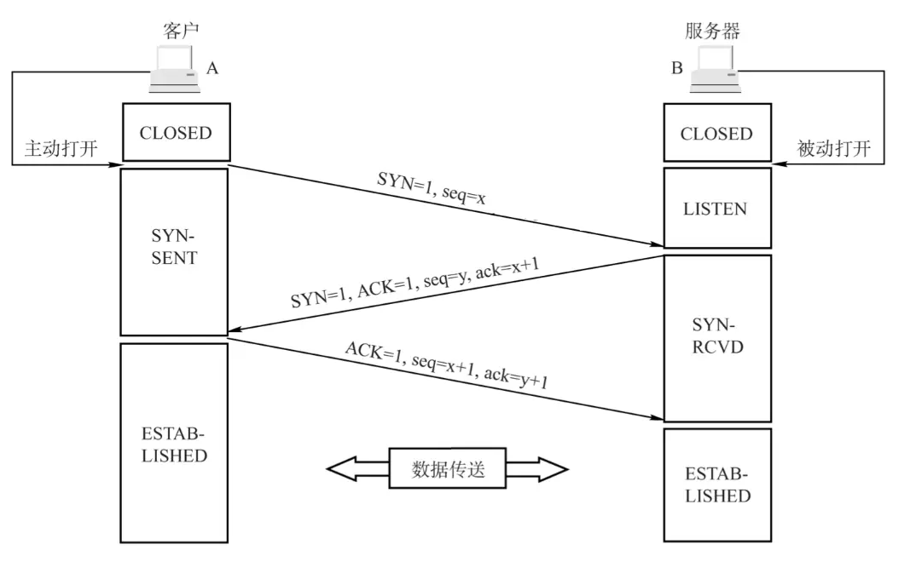
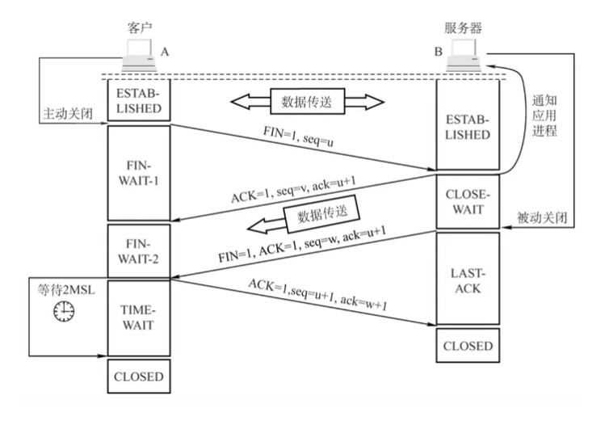

# TCP三次握手过程详解

    三次握手的原文是 three-way handshake，整个名词的可以翻译为：需要三个步骤才能建立握手/连接的机制。
    当然，三次握手也可以叫 three-message handshake，通过三条消息来建立的握手/连接。
    
    进行三次握手的主要作用就是为了确认双方的接收能力和发送能力是否正常、指定自己的 
    初始化序列号(Init Sequense Number, ISN) 为后面的可靠性传输做准备。

    🚀 SYN：连接请求/接收 报文段
    🚀 seq：发送的第一个字节的序号
    🚀 ACK：确认报文段
    🚀 ack：确认号。希望收到的下一个数据的第一个字节的序号

1）第一次握手：

    客户端向服务端发送一个 SYN 报文（SYN = 1），并指明客户端的初始化序列号 ISN(x)，
    即图中的 seq = x，表示本报文段所发送的数据的第一个字节的序号。此时客户端处于 SYN_Send 状态。

    SYN-SENT ：在发送连接请求后等待匹配的连接请求

2）第二次握手：

    服务器收到客户端的 SYN 报文之后，会发送 SYN 报文作为应答（SYN = 1），并且指定自己的初始化序列号 ISN(y)，
    即图中的 seq = y。同时会把客户端的 ISN + 1 作为确认号 ack 的值，表示已经收到了客户端发来的的 SYN 报文，
    希望收到的下一个数据的第一个字节的序号是 x + 1，此时服务器处于 SYN_REVD 的状态。

    SYN-RECEIVED：在收到和发送一个连接请求后等待对连接请求的确认

3）第三次握手：

    客户端收到服务器端响应的 SYN 报文之后，会发送一个 ACK 报文，也是一样把服务器的 ISN + 1 作为 ack 的值，
    表示已经收到了服务端发来的的 SYN 报文，希望收到的下一个数据的第一个字节的序号是 y + 1，
    并指明此时客户端的序列号 seq = x + 1（初始为 seq = x，所以第二个报文段要 +1），此时客户端处于 Establised 状态。

    服务器收到 ACK 报文之后，也处于 Establised 状态，至此，双方建立起了 TCP 连接。

    ESTABLISHED：代表一个打开的连接，数据可以传送给用户

## 1、为什么要三次握手

三次握手的目的是建立可靠的通信信道，说到通讯，简单来说就是数据的发送与接收，而三次握手最主要的目的就是双方确认自己与对方的发送与接收是正常的。

只有经过三次握手才能确认双发的收发功能都正常，缺一不可

第一次握手（客户端发送 SYN 报文给服务器，服务器接收该报文）：客户端什么都不能确认；服务器确认了对方发送正常，自己接收正常

第二次握手（服务器响应 SYN 报文给客户端，客户端接收该报文）
客户端确认了：自己发送、接收正常，对方发送、接收正常

服务器确认了：对方发送正常，自己接收正常

第三次握手（客户端发送 ACK 报文给服务器）
客户端确认了：自己发送、接收正常，对方发送、接收正常

服务器确认了：自己发送、接收正常，对方发送、接收正常

## 2、ISN (Initial Sequence Number) 是固定的吗

三次握手的其中一个重要功能是客户端和服务端交换 ISN(Initial Sequence Number)，以便让对方知道接下来接收数据的时候如何按序列号组装数据。

当一端为建立连接而发送它的 SYN 时，它会为连接选择一个初始序号。ISN 随时间而变化，
因此每个连接都将具有不同的 ISN。如果 ISN 是固定的，攻击者很容易猜出后续的确认号，因此 ISN 是动态生成的。

## 3、三次握手过程中可以携带数据吗
第三次握手的时候，是可以携带数据的。但是，第一次、第二次握手绝对不可以携带数据

假如第一次握手可以携带数据的话，如果有人要恶意攻击服务器，那他每次都在第一次握手中的 SYN 报文中放入大量的数据，
然后疯狂重复发 SYN 报文的话（因为攻击者根本就不用管服务器的接收、发送能力是否正常，它就是要攻击你），
这会让服务器花费很多时间、内存空间来接收这些报文。

⭐ 简单的记忆就是，请求连接/接收 即 SYN = 1 的时候不能携带数据

而对于第三次的话，此时客户端已经处于 ESTABLISHED 状态。对于客户端来说，他已经建立起连接了，
并且也已经知道服务器的接收、发送能力是正常的了，所以当然能正常发送/携带数据了。

## 4、半连接队列

服务器第一次收到客户端的 SYN 之后，就会处于 SYN_RCVD 状态，此时双方还没有完全建立其连接，
服务器会把这种状态下的请求连接放在一个队列里，我们把这种队列称之为半连接队列。

当然还有一个全连接队列，完成三次握手后建立起的连接就会放在全连接队列中。如果队列满了就有可能会出现丢包现象。

## 5、SYN 洪泛攻击

SYN 攻击就是 Client 在短时间内伪造大量不存在的 IP 地址，并向 Server 不断地发送 SYN 包，
Server 则回复确认包，并等待 Client 确认，由于源地址不存在，因此 Server 需要不断重发直至超时，
这些伪造的 SYN 包将长时间占用半连接队列，导致正常的 SYN 请求因为队列满而被丢弃，从而引起网络拥塞甚至系统瘫痪。

## 6、如果第三次握手丢失了，客户端服务端会如何处理

服务器发送完 SYN-ACK 包，如果未收到客户端响应的确认包，也即第三次握手丢失。那么服务器就会进行首次重传，
若等待一段时间仍未收到客户确认包，就进行第二次重传。如果重传次数超过系统规定的最大重传次数，则系统将该连接信息从半连接队列中删除。

注意，每次重传等待的时间不一定相同，一般会是指数增长，例如间隔时间为 1s，2s，4s，

# TCP 四次挥手释放连接

TCP 连接的释放需要发送四个包（执行四个步骤），因此称为四次挥手(Four-way handshake)，客户端或服务端均可主动发起挥手动作。

    🚀 FIN ：连接终止位
    🚀 seq：发送的第一个字节的序号
    🚀 ACK：确认报文段
    🚀 ack：确认号。希望收到的下一个数据的第一个字节的序号

1）第一次挥手：

    客户端发送一个 FIN 报文（请求连接终止：FIN = 1），报文中会指定一个序列号 seq = u。
    并停止再发送数据，主动关闭 TCP 连接。此时客户端处于 FIN_WAIT1 状态，等待服务端的确认。

    FIN-WAIT-1 - 等待远程TCP的连接中断请求，或先前的连接中断请求的确认

2）第二次挥手：

    服务端收到 FIN 之后，会发送 ACK 报文，且把客户端的序号值 +1 作为 ACK 报文的序列号值，
    表明已经收到客户端的报文了，此时服务端处于 CLOSE_WAIT 状态。

    CLOSE-WAIT - 等待从本地用户发来的连接中断请求

    此时的 TCP 处于半关闭状态，客户端到服务端的连接释放。客户端收到服务端的确认后，
    进入FIN_WAIT2（终止等待 2）状态，等待服务端发出的连接释放报文段。

    FIN-WAIT-2 - 从远程TCP等待连接中断请求

3）第三次挥手：

    如果服务端也想断开连接了（没有要向客户端发出的数据），和客户端的第一次挥手一样，发送 FIN 报文，
    且指定一个序列号。此时服务端处于 LAST_ACK 的状态，等待客户端的确认。

    LAST-ACK - 等待原来发向远程TCP的连接中断请求的确认

4）第四次挥手：

    客户端收到 FIN 之后，一样发送一个 ACK 报文作为应答（ack = w+1），且把服务端的序列值 +1 作为自己 ACK 
    报文的序号值（seq=u+1），此时客户端处于 TIME_WAIT （时间等待）状态。

    TIME-WAIT - 等待足够的时间以确保远程TCP接收到连接中断请求的确认；

🚨 注意 ！！！这个时候由服务端到客户端的 TCP 连接并未释放掉，需要经过时间等待计时器设置的时间 2MSL（一个报文的来回时间） 
后才会进入 CLOSED 状态（这样做的目的是确保服务端收到自己的 ACK 报文。如果服务端在规定时间内没有收到客户端发来的 ACK 报文的话，
服务端会重新发送 FIN 报文给客户端，客户端再次收到 FIN 报文之后，就知道之前的 ACK 报文丢失了，然后再次发送 ACK 报文给服务端）。
服务端收到 ACK 报文之后，就关闭连接了，处于 CLOSED 状态

## 为什么要四次挥手

由于 TCP 的半关闭（half-close）特性，TCP 提供了连接的一端在结束它的发送后还能接收来自另一端数据的能力。

任何一方都可以在数据传送结束后发出连接释放的通知，待对方确认后进入半关闭状态。当另一方也没有数据再发送的时候，则发出连接释放通知，
对方确认后就完全关闭了TCP连接。

通俗的来说，两次握手就可以释放一端到另一端的 TCP 连接，完全释放连接一共需要四次握手。

举个例子：

    A 和 B 打电话，通话即将结束后，A 说 “我没啥要说的了”，B 回答 “我知道了”，
    于是 A 向 B 的连接释放了。但是 B 可能还会有要说的话，于是 B 可能又巴拉巴拉说了一通，最后 B 说“我说完了”，
    A 回答“知道了”，于是 B 向 A 的连接释放了，这样整个通话就结束了。

