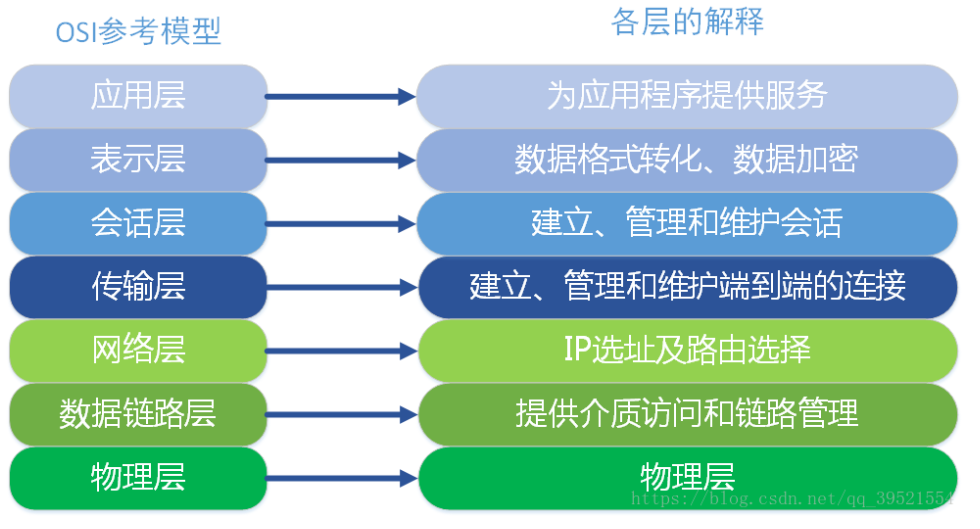
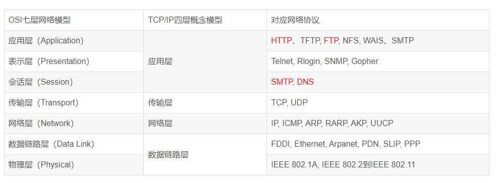
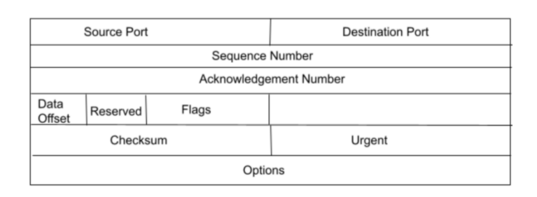
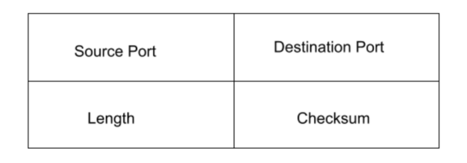

# OSI模型
    
    OSI定义了网络互连的七层框架（物理层、数据链路层、网络层、传输层、会话层、表示层、应用层），即ISO开放互连系统参考模型。    

    🚀 OSI引入了服务、接口、协议、分层的概念，TCP/IP借鉴了OSI的这些概念建立TCP/IP模型。
    
    🚀 OSI先有模型，后有协议，先有标准，后进行实践；而TCP/IP则相反，先有协议和应用再提出了模型，且是参照的OSI模型。
    
    🚀 OSI是一种理论下的模型，而TCP/IP已被广泛使用，成为网络互联事实上的标准。

# TCP/IP四层模型

# TCP 与 UDP 的区别

UDP 是一种无连接协议，而 TCP 是一种面向连接的协议。TCP 比 UDP 要慢，这是两种协议的主要区别之一。

总的来说，UDP 是一种更快、更简单、更高效的协议。但是只有 TCP 允许对丢失的数据包进行重新传输。

TCP 和 UDP 的另一个区别是 TCP 可以确保数据从用户到服务器的有序传输（反之亦然）。
UDP 不是为端到端通信而设计的，并不会检查接收方的准备情况，因此它需要相对更少的开销并占用更少的空间。

### TCP 与 UDP 的总结

连接

    TCP 要求在发送方和接收方开始通信之前建立一个良好的连接，它是一个面向连接的协议。

    UDP 是一种无连接协议。

保持数据传输的顺序

    在 TCP 中，由于事先建立了一个良好的连接，接收方以有序的方式接收数据包。
    
    而在 UDP 中，发送方与接收方之间并没有建立良好的连接，接收方将以无序的方式接收数据包。

可靠性

    每当通过 TCP 接收到数据包时，接收方都会向发送方发送一条确认。万一失败，它会请求重新传输。
    
    而使用 UDP，在这种情况下不会发送确认，它依赖于高层协议来确保可靠性。

错误检查

    TCP 中有广泛的错误检查规则，而 UDP 中只有基本的错误检查技术，例如校验和。

传输方法

    在 TCP 中，数据以字节流的形式读取，消息被发送到段边界。
    
    而在 UDP 中，已定义限制的单个 UDP 数据包被发送，在到达接收方时验证其完整性。

广播

    TCP 不支持广播。当你使用它时，发送方和接收方必须先建立一条连接，在传输结束后又必须终止这条连接。
    
    UDP 支持广播。

TCP 与 UDP 的用例

    TCP 被用于 HTTPS（安全超文本传输协议）、HTTP（超文本传输协议）、SMTP（简单邮件传输协议）、FTP（文件传输协议）等等。
    
    UDP 用于视频流、视频电话、IP 语音服务（互联网呼叫）、DNS（域名系统）等。

# TCP报头

    TCP 报头的长度必须至少为 20 字节且不超过 60 字节

TCP 的报头包括：

    🚀 源端口 - 表示发送设备的源端口。占 16 位。
    🚀 目的端口 - 表示接收设备上的目的端口。占 16 位。
    🚀 序号 - 表示在一个会话中数据段的序号。占 32 位。
    🚀 确认号 - 该编号包括下一个预期的数据字节的序号，并在 ACK 标志被设置时，用作对先前接收到的数据的确认。占 32 位。
    🚀 数据偏移 - 该字段表示整个 TCP 报头的大小（32 位字）以及当前数据包在整个 TCP 段上的数据偏移量。占 4 位。
    🚀 保留 - 供将来使用的位，默认情况下设置为 0。占 3 位。
    🚀 标志 - 为各种标志保留了 1 位，这些标志有助于 TCP 检查各种活动，例如确认。
    🚀 校验和 - 该字段包含校验和。
    🚀 紧急指针 - 如果 URG 标志设置为 1，则指定数据字节。
    🚀 选项 - 指定了在常规报头中不存在的其他选项。

# UDP报头

    🚀 源端口 - 表示发送设备的源端口。占 16 位。
    🚀 目的端口 - 表示接收设备上的目的端口。占 16 位。
    🚀 长度 - 指定 UDP 数据包的整体长度。它是一个 16 位的字段，最小值为 8 字节，等于 UDP 报头本身的大小。
    🚀 校验和 - 发送方在发送之前创建的校验和存储在此字段中。
    该字段在 IPv4 中是可选的，因此如果它不包含任何值，则设置为 0，并且其所有位都设置为 0。

