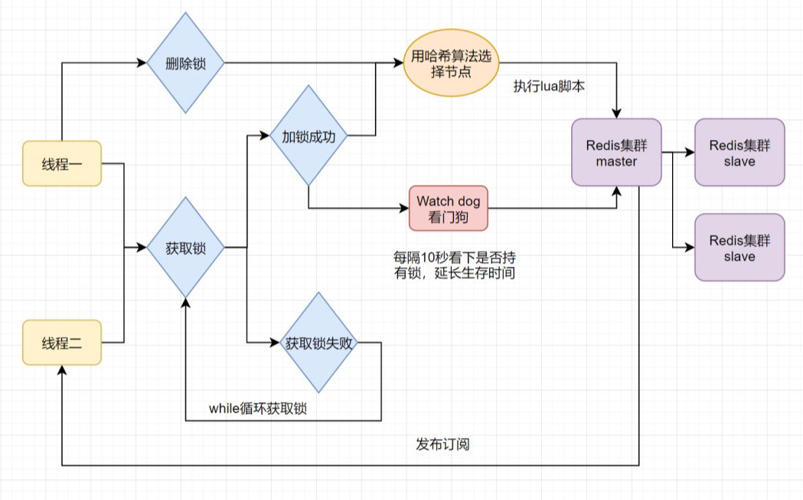
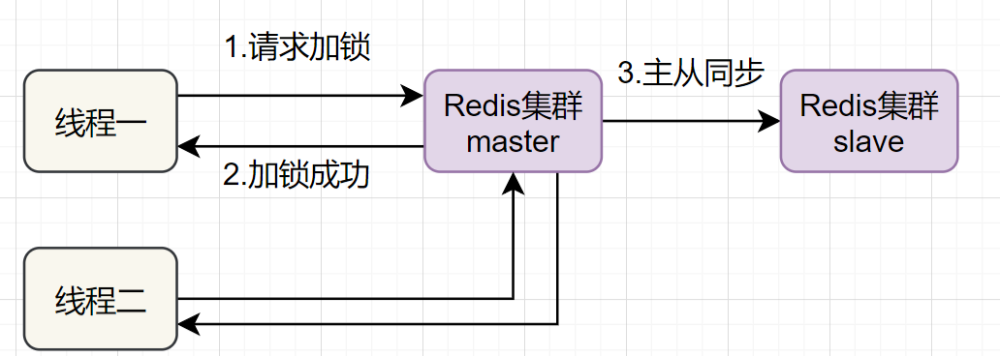
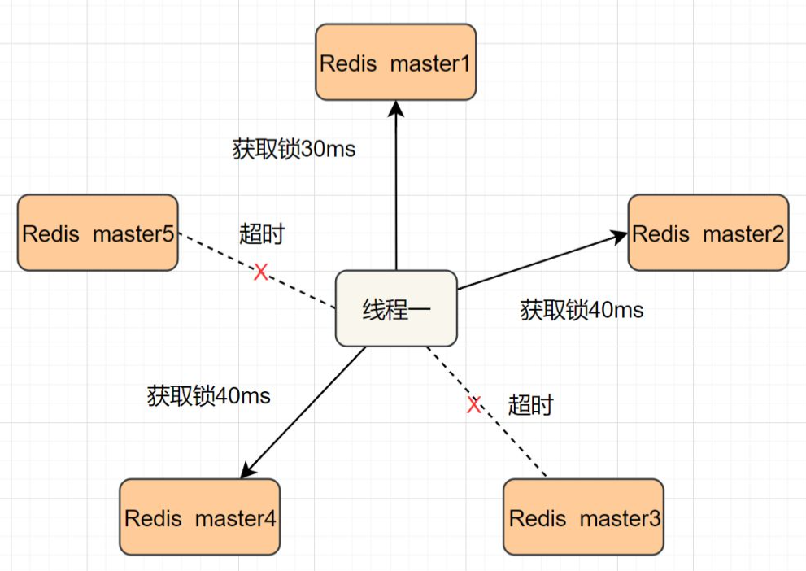

# 分布式锁

    是控制分布式系统不同进程共同访问共享资源的一种锁的实现。
    秒杀下单、抢红包等等业务场景，都需要用到分布式锁


set ex px nx + 校验唯一随机值,再删除

```
if（jedis.set(key, uni_request_id, "NX", "EX", 100s) == 1）{ 
//加锁
 try { 
        // do something //业务处理 
      }catch(){ 
      
      } finally { 
        //判断是不是当前线程加的锁,是才释放 
          if (uni_request_id.equals(jedis.get(key))) {
              jedis.del(key); //释放锁 
          } 
      } 
}
// 在这里，判断当前线程加的锁和释放锁是不是一个原子操作。如果调用jedis.del()释放锁的时候，可能这把锁已经不属于当前客户端，会解除他人加的锁。

```

# Redisson 原理





    只要线程一加锁成功，就会启动一个watch dog看门狗，它是一个后台线程，会每隔10秒检查一下，
    如果线程1还持有锁，那么就会不断的延长锁key的生存时间。
    因此，Redisson就是使用Redisson解决了锁过期释放，业务没执行完问题。


# 什么是Redlock算法

    Redis一般都是集群部署的，假设数据在主从同步过程，主节点挂了，
    Redis分布式锁可能会有哪些问题呢？一起来看些这个流程图：




    如果线程一在Redis的master节点上拿到了锁，但是加锁的key还没同步到slave节点。
    恰好这时，master节点发生故障，一个slave节点就会升级为master节点。
    线程二就可以获取同个key的锁啦，但线程一也已经拿到锁了，锁的安全性就没了。
    
    为了解决这个问题，Redis作者 antirez提出一种高级的分布式锁算法：Redlock。

Redlock核心思想是这样的：
    
    搞多个Redis master部署，以保证它们不会同时宕掉。并且这些master节点是完全相互独立的，
    相互之间不存在数据同步。同时，需要确保在这多个master实例上，是与在Redis单实例，
    使用相同方法来获取和释放锁。
    
    我们假设当前有5个Redis master节点，在5台服务器上面运行这些Redis实例。





RedLock的实现步骤:如下

    1.获取当前时间，以毫秒为单位。
    2.按顺序向5个master节点请求加锁。客户端设置网络连接和响应超时时间，并且超时时间要小于锁的失效时间。
    （假设锁自动失效时间为10秒，则超时时间一般在5-50毫秒之间,我们就假设超时时间是50ms吧）。
    如果超时，跳过该master节点，尽快去尝试下一个master节点。
    3.客户端使用当前时间减去开始获取锁时间（即步骤1记录的时间），得到获取锁使用的时间。
    当且仅当超过一半（N/2+1，这里是5/2+1=3个节点）的Redis master节点都获得锁，
    并且使用的时间小于锁失效时间时，锁才算获取成功。（如上图，10s> 30ms+40ms+50ms+4m0s+50ms）
    如果取到了锁，key的真正有效时间就变啦，需要减去获取锁所使用的时间。
    如果获取锁失败（没有在至少N/2+1个master实例取到锁，有或者获取锁时间已经超过了有效时间），客户端要在所有的master节点上解锁（即便有些master节点根本就没有加锁成功，也需要解锁，以防止有些漏网之鱼）。

简化下步骤就是：
    
    🚀 按顺序向5个master节点请求加锁
    🚀 根据设置的超时时间来判断，是不是要跳过该master节点。
    🚀 如果大于等于三个节点加锁成功，并且使用的时间小于锁的有效期，即可认定加锁成功啦。
    🚀 如果获取锁失败，解锁！


