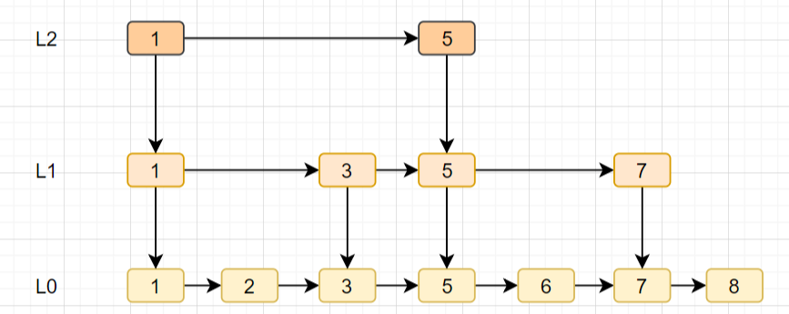

<a href="#title1">1.什么是Redis？它主要用来什么的？</a>

<a href="#title2">2.Redis的基本数据结构类型</a>

<a href="#title3">3.Redis是单线程吗？</a>

<a href="#title4">4.Redis 单线程为什么还能这么快？</a>

<a href="#title5">5.Redis 单线程如何处理那么多的并发客户端连接？</a>

# <h2 id="title1">1.什么是Redis？它主要用来什么的？</h2>

    Redis，英文全称是Remote Dictionary Server（远程字典服务），
    是一个开源的使用ANSI C语言编写、支持网络、可基于内存亦可持久化的
    日志型、Key-Value数据库，并提供多种语言的API。

    与MySQL数据库不同的是，Redis的数据是存在内存中的。它的读写速度非
    常快，每秒可以处理超过10万次读写操作。因此redis被广泛应用于缓存，
    另外，Redis也经常用来做分布式锁。除此之外，Redis支持事务、持久化、
    LUA 脚本、LRU 驱动事件、多种集群方案。

# <h2 id="title2">2.Redis的基本数据结构类型</h2>

    Redis有以下这五种基本类型：
    
    String（字符串）
    Hash（哈希）
    List（列表）
    Set（集合）
    zset（有序集合）
### String（字符串）

    （1）是Redis最基本的数据类型，一个键最大能存储512MB。
    
    （2）可以存储3种类型的值，字节串、整数、浮点数。这里整数或者浮点数是可以执行自增或自减的。
    
    （3）可以包含任何数据，比如jpg图片(生成二进制)或者序列化的对象。


常用命令
```
set <key><value>  添加键值对

get <key> 查询对应键值

append <key><value>将给定的<value> 追加到原值的末尾

incr <key> 将 key 中储存的数字值增1，只能对数字值操作，如果为空，新增值为1

decr <key>  将 key 中储存的数字值减1，只能对数字值操作，如果为空，新增值为-1

```

应用场景

    🚀 计数器
    
    🚀 统计多单位的数量
    
    🚀 粉丝数
    
    🚀 对象缓存存储

### Hash（哈希）
    （1）hash是一个string 类型的field和value的映射表。
    
    （2）Redis 中每个 hash 可以存储40多亿键值对。
    
    （3）采用key—field—value的方式。一个key可对应多个field，一个field对应一个value。
    
    （4）hash特别适合存储对象，相对于将对象的每个字段存成单个string 类型。一个对象存储在hash类型
        中会占用更少的内存，并且可以更方便的存取整个对象。

常用命令
```
```


应用场景

    🚀 适用于存储对象（object）信息，如用户详细信息，用户id为key，他的姓名、性别、年龄等信息为field-value。
    
    🚀 存储多个用户信息，可以将filed存为用户id，每个用户的信息序列化为json存于value。

### List（列表）

    （1）Redis的list类型其实就是一个每个子元素都是string类型的双向链表，
        可以添加一个元素到列表的头部（左边）或者尾部（右边）。
    
    （2）一个列表最多可以包含超过40亿个元素。
常用命令

```
lpush/rpush  <key><value1><value2><value3> .... 从左边/右边插入一个或多个值。

lpop/rpop  <key>从左边/右边吐出一个值。值在键在，值光键亡。

rpoplpush  <key1><key2>从<key1>列表右边吐出一个值，插到<key2>列表左边。

lrange mylist 0 -1   0左边第一个，-1右边第一个，（0-1表示获取所有）
```

应用场景

    🚀 存储key-list数据，具有一对多的数据关系，可以制作微博的用户关注列表；
    
    🚀 可以当作消息队列，可以利用 List 的 *PUSH 操作，将任务存在 List 中，然后工作线程再用 POP 操作将任务取出进行执行。


### Set（集合）

    （1）集合成员是唯一的，这就意味着集合中不能出现重复的数据。

    （2）集合是通过哈希表实现的，所以添加，删除，查找的复杂度都是 O(1)。
    
    （3）可以进行取并集，交集，差集操作。
    
    （4）每个集合可存储40多亿个成员。
常用命令
```
```
应用场景

    🚀 查找共同好友、二度好友，共同喜好。
    
    🚀 利用唯一性，可以统计访问网站的所有独立 IP。

    🚀 好友推荐的时候，根据 tag 求交集，大于某个 threshold 就可以推荐

### zset（有序集合）


    一个非常特别的数据结构，一方面它等价于Java的数据结构Map<String, Double>，可以给每一个元素value赋予一个权重score，
    另一方面它又类似于TreeSet，内部的元素会按照权重score进行排序，可以得到每个元素的名次，还可以通过score的范围来获取元素的列表。

    （1）Redis 有序集合和集合一样也是 string 类型元素的集合,且不允许重复的成员。
    
    （2）每个元素都会关联一个 double 类型的分数。redis 正是通过分数来为集合中的成员进行从小到大的排序。
    
    （3）有序集合的成员是唯一的,但分数(score)却可以重复。
    
    （4）集合是通过哈希表实现的，所以添加，删除，查找的复杂度都是 O(1)。
    
    （5）每个集合可存储40多亿个成员。

    zset底层使用了两个数据结构

    （1）hash，hash的作用就是关联元素value和权重score，保障元素value的唯一性，可以通过元素value找到相应的score值。
    
    （2）跳跃表，跳跃表的目的在于给元素value排序，根据score的范围获取元素列表。



        🚀 跳表的特点:
        由许多层结构组成。
        每一层都是一个有序的链表。
        最底层 (Level 1) 的链表包含所有元素。
        如果一个元素出现在 Level i 的链表中，则它在 Level i 之下的链表也都会出现。
        每个节点包含两个指针，一个指向同一链表中的下一个元素，一个指向下面一层的元素。

        🚀 跳表的优点：
        跳表可以保证增、删、查等操作时的时间复杂度为O(logN)，且维持结构平衡的成本比较低，完全依靠随机。
        而二叉查找树在多次插入删除后，需要Rebalance来重新调整结构平衡。
        
        🚀 跳表的缺点：
        跳表占用的空间比较大（多级索引），其实就是一种空间换时间的思想。


常用命令
```
将一个或多个 member 元素及其 score 值加入到有序集 key 当中
zadd  <key><score1><value1><score2><value2>…

返回有序集 key 中，下标在<start><stop>之间的元素，带WITHSCORES，可以让分数一起和值返回到结果集
zrange <key><start><stop> [WITHSCORES]

```


应用场景

    🚀 带有权重的元素，比如用户的积分排行榜需求可以通过有序集合实现。
    
    🚀 存储全班同学成绩的 Sorted Sets，其集合 value 可以是同学的学号，而 score 就可以是其考试得分

    🚀 延时队列


# <h2 id="title3">3.Redis是单线程吗？</h2>

    Redis 的单线程主要是指 Redis 的网络 IO 和键值对读写是由一个线程来完成的，
    这也是 Redis 对外提供键值存储服务的主要流程。但 Redis 的其他功能，比如
    持久化、异步删除、集群数据同步等，其实是由额外的线程执行的。

# <h2 id="title4">4.Redis 单线程为什么还能这么快？</h2>

    因为它所有的数据都在内存中，所有的运算都是内存级别的运算，而且单线程避免了
    多线程的切换性能损耗问题。正因为 Redis 是单线程，所以要小心使用 Redis 
    指令，对于那些耗时的指令(比如keys)，一定要谨慎使用，一不小心就可能会导致 Redis 卡顿。


# <h2 id="title5">5.Redis 单线程如何处理那么多的并发客户端连接？</h2>

    Redis的IO多路复用：redis利用epoll来实现IO多路复用，将连接信息和事件放到队列中，
    依次放到文件事件分派器，事件分派器将事件分发给事件处理器。


