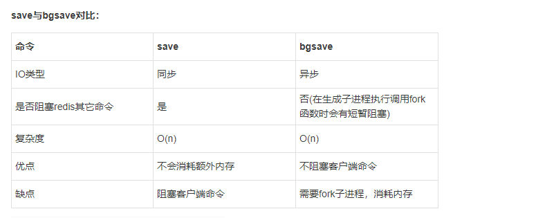
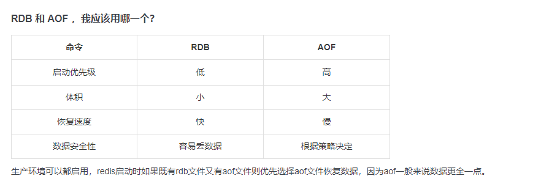
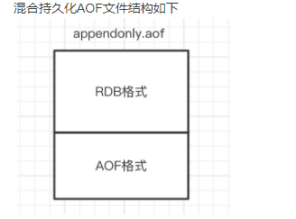
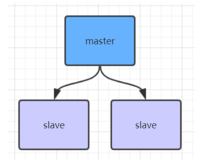
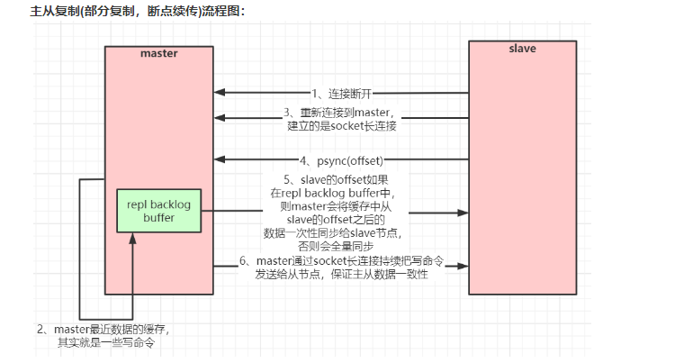
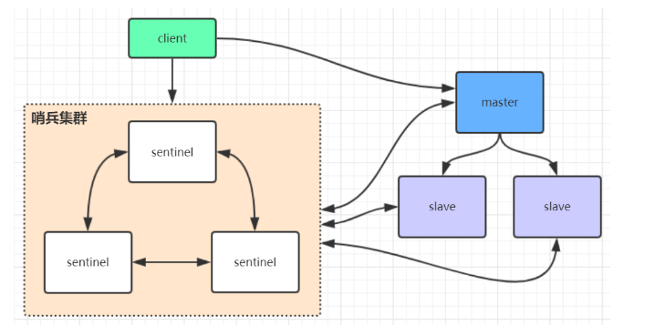

<a href="#title1">1.Redis持久化</a>

<a href="#title2">2.Redis 4.0 混合持久化</a>

<a href="#title3">3.Redis数据备份策略</a>

<a href="#title4">4.Redis主从架构</a>

<a href="#title5">5.Redis主从工作原理</a>

<a href="#title6">6.Redis哨兵高可用架构</a>


# <h2 id="title1">1.Redis持久化</h2>
## RDB快照（snapshot）
    在默认情况下， Redis 将内存数据库快照保存在名字为dump.rdb的二进制文件中。
    你可以对 Redis 进行设置， 让它在“秒内数据集至少有个改动”这一条件被满足时， 
    自动保存一次数据集。
    比如说， 以下设置会让 Redis 在满足“60秒内有至少有1000个键被改动”这一条件时， 
    自动保存一次数据集：
        # save 60 1000    //关闭RDB只需要将所有的save保存策略注释掉即可

    还可以手动执行命令生成RDB快照，进入redis客户端执行命令save或bgsave可以
    生成dump.rdb文件，每次命令执行都会将所有redis内存快照到一个新的rdb文件里，
    并覆盖原有rdb快照文件

## bgsave的写时复制(COW)机制
    Redis 借助操作系统提供的写时复制技术（Copy-On-Write, COW），
    在生成快照的同时，依然可以正常处理写命令。
    简单来说，bgsave 子进程是由主线程 fork 生成的，可以共享主线程的所有内存数据。
    bgsave 子进程运行后，开始读取主线程的内存数据，并把它们写入 RDB 文件。
    此时，如果主线程对这些数据也都是读操作，那么，主线程和 bgsave 子进程相互不影响。
    但是，如果主线程要修改一块数据，那么，这块数据就会被复制一份，生成该数据的副本。
    然后，bgsave 子进程会把这个副本数据写入 RDB 文件，而在这个过程中，
    主线程仍然可以直接修改原来的数据。



# AOF（append-only file）

    快照功能并不是非常耐久（durable）： 如果 Redis 因为某些原因而造成故障停机， 
    那么服务器将丢失最近写入、且仍未保存到快照中的那些数据。从 1.1 版本开始，
    Redis 增加了一种完全耐久的持久化方式： AOF 持久化，将修改的每一条指令
    记录进文件appendonly.aof中(先写入os cache，每隔一段时间fsync到磁盘)
    比如执行命令“set Kray 666”，aof文件里会记录如下数据


```
*3
$3
set
$5
Kray
$3
666
```
    你可以通过修改配置文件来打开 AOF 功能：
    # appendonly yes
    如下两个配置可以控制AOF自动重写频率
    # auto-aof-rewrite-min-size 64mb   //aof文件至少要达到64M才会自动重写，文件太小恢复速度本来就很快，重写的意义不大
    # auto-aof-rewrite-percentage 100  //aof文件自上一次重写后文件大小增长了100%则再次触发重写




# <h2 id="title2">2.Redis 4.0 混合持久化</h2>


    重启 Redis 时，我们很少使用 RDB来恢复内存状态，因为会丢失大量数据。
    我们通常使用 AOF 日志重放，但是重放 AOF 日志性能相对 RDB来说要慢很多，
    这样在 Redis 实例很大的情况下，启动需要花费很长的时间。 
    Redis 4.0 为了解决这个问题，带来了一个新的持久化选项——混合持久化。
    通过如下配置可以开启混合持久化(必须先开启aof)：
    # aof-use-rdb-preamble yes

    如果开启了混合持久化，AOF在重写时，不再是单纯将内存数据转换为RESP命令写入AOF文件，
    而是将重写这一刻之前的内存做RDB快照处理，并且将RDB快照内容和增量的AOF修改内存数据的命令存在一起，
    都写入新的AOF文件，新的文件一开始不叫appendonly.aof，等到重写完新的AOF文件才会进行改名，
    覆盖原有的AOF文件，完成新旧两个AOF文件的替换。
    于是在 Redis 重启的时候，可以先加载 RDB 的内容，然后再重放增量 AOF 日志就可以完全替代之前的 AOF 全量文件重放，因此重启效率大幅得到提升。





# <h2 id="title3">3.Redis数据备份策略：</h2>
    写crontab定时调度脚本，每小时都copy一份rdb或aof的备份到一个目录中去，仅仅保留最近48小时的备份
    每天都保留一份当日的数据备份到一个目录中去，可以保留最近1个月的备份
    每次copy备份的时候，都把太旧的备份给删了
    每天晚上将当前机器上的备份复制一份到其他机器上，以防机器损坏


# 
# <h2 id="title4">4.Redis主从架构</h2>



# <h2 id="title5">5.Redis主从工作原理</h2>




# 
# <h2 id="title6">6.Redis哨兵高可用架构</h2>


    sentinel哨兵是特殊的redis服务，不提供读写服务，主要用来监控redis实例节点。
    哨兵架构下client端第一次从哨兵找出redis的主节点，后续就直接访问redis的主节点，
    不会每次都通过sentinel代理访问redis的主节点，当redis的主节点发生变化，
    哨兵会第一时间感知到，并且将新的redis主节点通知给client端
    (这里面redis的client端一般都实现了订阅功能，订阅sentinel发布的节点变动消息)


    主从模式中，一旦主节点由于故障不能提供服务，需要人工将从节点晋升为主节点，同时还要通知应用方更新主节点地址。
    显然，多数业务场景都不能接受这种故障处理方式。Redis从2.8开始正式提供了Redis Sentinel（哨兵）架构来解决这个问题。

    哨兵模式，由一个或多个Sentinel实例组成的Sentinel系统，它可以监视所有的Redis主节点和从节点，并在被监视的主节点进入下线状态时，
    自动将下线主服务器属下的某个从节点升级为新的主节点。但是呢，一个哨兵进程对Redis节点进行监控，就可能会出现问题（单点问题），
    因此，可以使用多个哨兵来进行监控Redis节点，并且各个哨兵之间还会进行监控。

简单来说，哨兵模式就三个作用：

    🚀 发送命令，等待Redis服务器（包括主服务器和从服务器）返回监控其运行状态；
    🚀 哨兵监测到主节点宕机，会自动将从节点切换成主节点，然后通过发布订阅模式通知其他的从节点，修改配置文件，让它们切换主机；
    🚀 哨兵之间还会相互监控，从而达到高可用。

故障切换的过程是怎样的呢

    假设主服务器宕机，哨兵1先检测到这个结果，系统并不会马上进行 failover 过程，仅仅是哨兵1主观的认为主服务器不可用，
    这个现象成为主观下线。当后面的哨兵也检测到主服务器不可用，并且数量达到一定值时，那么哨兵之间就会进行一次投票，投票的结果由一个哨兵发起，
    进行 failover 操作。切换成功后，就会通过发布订阅模式，让各个哨兵把自己监控的从服务器实现切换主机，这个过程称为客观下线。
    这样对于客户端而言，一切都是透明的。

哨兵的工作模式如下：

    🚀 每个Sentinel以每秒钟一次的频率向它所知的Master，Slave以及其他Sentinel实例发送一个 PING命令。
    🚀 如果一个实例（instance）距离最后一次有效回复 PING 命令的时间超过 down-after-milliseconds 选项所指定的值，
    则这个实例会被 Sentinel标记为主观下线。
    🚀 如果一个Master被标记为主观下线，则正在监视这个Master的所有 Sentinel 要以每秒一次的频率确认Master的确进入了主观下线状态。
    🚀 当有足够数量的 Sentinel（大于等于配置文件指定的值）在指定的时间范围内确认Master的确进入了主观下线状态， 则Master会被标记为客观下线。
    🚀 在一般情况下， 每个 Sentinel 会以每10秒一次的频率向它已知的所有Master，Slave发送 INFO 命令。
    🚀 当Master被 Sentinel 标记为客观下线时，Sentinel 向下线的 Master 的所有 Slave 发送 INFO 命令的频率会从 10 秒一次改为每秒一次
    🚀 若没有足够数量的 Sentinel同意Master已经下线， Master的客观下线状态就会被移除；若Master 重新向 Sentinel 的 
    PING 命令返回有效回复， Master 的主观下线状态就会被移除。
    


