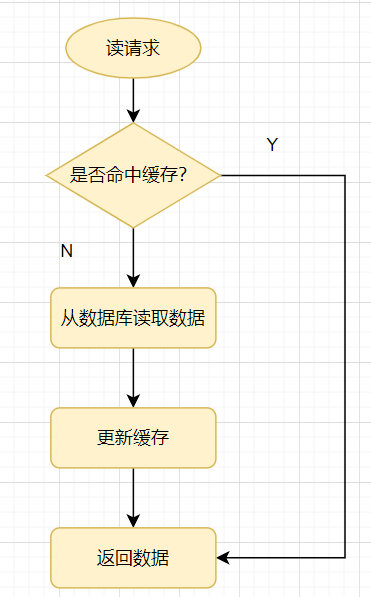
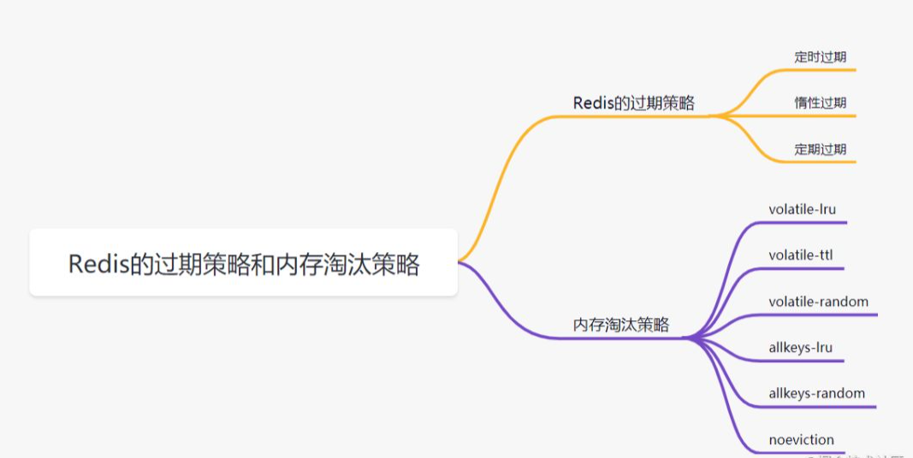

<a href="#title1">1.缓存穿透</a>

<a href="#title2">2.缓存雪崩</a>

<a href="#title3">3.缓存击穿</a>

<a href="#title4">4.什么是热Key问题，如何解决热key问题</a>

<a href="#title5">5.Redis的过期策略</a>

<a href="#title6">6.Redis 内存淘汰策略</a>

    先来看一个常见的缓存使用方式：读请求来了，先查下缓存，缓存有值命中，就直接返回；
    缓存没命中，就去查数据库，然后把数据库的值更新到缓存，再返回。

# <h2 id="title1">1.缓存穿透</h2>

    指查询一个一定不存在的数据，由于缓存是不命中时需要从数据库查询，查不到数据则不写入缓存，
    这将导致这个不存在的数据每次请求都要到数据库去查询，进而给数据库带来压力。

    通俗点说，读请求访问时，缓存和数据库都没有某个值，这样就会导致每次对这个值的查询请求都会穿透到数据库，这就是缓存穿透。

缓存穿透一般都是这几种情况产生的：

    🚀 业务不合理的设计，比如大多数用户都没开守护，但是你的每个请求都去缓存，查询某个userid查询有没有守护。
    🚀 业务/运维/开发失误的操作，比如缓存和数据库的数据都被误删除了。
    🚀 黑客非法请求攻击，比如黑客故意捏造大量非法请求，以读取不存在的业务数据。

如何避免缓存穿透呢？ 一般有三种方法。

    1.如果是非法请求，我们在API入口，对参数进行校验，过滤非法值。
    2.如果查询数据库为空，我们可以给缓存设置个空值，或者默认值。但是如有有写请求进来的话，需要更新缓存哈，
      以保证缓存一致性，同时，最后给缓存设置适当的过期时间。（业务上比较常用，简单有效）
    3.使用布隆过滤器快速判断数据是否存在。即一个查询请求过来时，先通过布隆过滤器判断值是否存在，存在才继续往下查。

布隆过滤器原理：

    它由初始值为0的位图数组和N个哈希函数组成。一个对一个key进行N个hash算法获取N个值，
    在比特数组中将这N个值散列后设定为1，然后查的时候如果特定的这几个位置都为1，那么布隆过滤器判断该key存在。

# <h2 id="title2">2.缓存雪崩</h2>

    指缓存中数据大批量到过期时间，而查询数据量巨大，请求都直接访问数据库，引起数据库压力过大甚至down机。

    缓存雪奔一般是由于大量数据同时过期造成的，对于这个原因，可通过均匀设置过期时间解决，即让过期时间相对离散一点。
    如采用一个较大固定值+一个较小的随机值，5小时+0到1800秒酱紫。
    Redis 故障宕机也可能引起缓存雪奔。这就需要构造Redis高可用集群啦。 

# <h2 id="title3">3.缓存击穿</h2>

    指热点key在某个时间点过期的时候，而恰好在这个时间点对这个Key有大量的并发请求过来，从而大量的请求打到db。

    缓存击穿看着有点像，其实它两区别是，缓存雪奔是指数据库压力过大甚至down机，缓存击穿只是大量并发请求到了DB数据库层面。
    可以认为击穿是缓存雪奔的一个子集吧。有些文章认为它俩区别，是区别在于击穿针对某一热点key缓存，雪奔则是很多key。

解决方案就有两种：

    1.使用互斥锁方案。缓存失效时，不是立即去加载db数据，而是先使用某些带成功返回的原子操作命令，如(Redis的setnx）去操作，成功的时候，再去加载db数据库数据和设置缓存。否则就去重试获取缓存。
    2. “永不过期”，是指没有设置过期时间，但是热点数据快要过期时，异步线程去更新和设置过期时间。

# <h2 id="title4">4.什么是热Key问题，如何解决热key问题</h2>

    在Redis中，我们把访问频率高的key，称为热点key。
    如果某一热点key的请求到服务器主机时，由于请求量特别大，可能会导致主机资源不足，甚至宕机，从而影响正常的服务。

热点Key是怎么产生的呢？主要原因有两个：

    🚀 用户消费的数据远大于生产的数据，如秒杀、热点新闻等读多写少的场景。
    🚀 请求分片集中，超过单Redi服务器的性能，比如固定名称key，Hash落入同一台服务器，瞬间访问量极大，超过机器瓶颈，产生热点Key问题。

如何解决热key问题？
    
    🚀 Redis集群扩容：增加分片副本，均衡读流量；
    🚀 将热key分散到不同的服务器中；
    🚀 使用二级缓存，即JVM本地缓存,减少Redis的读请求。

# 
# <h2 id="title5">5.Redis的过期策略</h2>

我们在set key的时候，可以给它设置一个过期时间，比如expire key 60。
指定这key60s后过期，60s后，redis是如何处理的嘛？我们先来介绍几种过期策略：

### 定时过期
    每个设置过期时间的key都需要创建一个定时器，到过期时间就会立即对key进行清除。
    该策略可以立即清除过期的数据，对内存很友好；但是会占用大量的CPU资源去处理过期的数据，从而影响缓存的响应时间和吞吐量。

### 惰性过期

    只有当访问一个key时，才会判断该key是否已过期，过期则清除。该策略可以最大化地节省CPU资源，却对内存非常不友好。
    极端情况可能出现大量的过期key没有再次被访问，从而不会被清除，占用大量内存。

### 定期过期

    每隔一定的时间，会扫描一定数量的数据库的expires字典中一定数量的key，并清除其中已过期的key。
    该策略是前两者的一个折中方案。通过调整定时扫描的时间间隔和每次扫描的限定耗时，可以在不同情况下使得CPU和内存资源达到最优的平衡效果。

    expires字典会保存所有设置了过期时间的key的过期时间数据，其中，key是指向键空间中的某个键的指针，value是该键的毫秒精度的
    UNIX时间戳表示的过期时间。键空间是指该Redis集群中保存的所有键。

Redis中同时使用了惰性过期和定期过期两种过期策略。

    假设Redis当前存放30万个key，并且都设置了过期时间，如果你每隔100ms就去检查这全部的key，CPU负载会特别高，最后可能会挂掉。
    因此，redis采取的是定期过期，每隔100ms就随机抽取一定数量的key来检查和删除的。
    但是呢，最后可能会有很多已经过期的key没被删除。这时候，redis采用惰性删除。在你获取某个key的时候，redis会检查一下，
    这个key如果设置了过期时间并且已经过期了，此时就会删除。

# <h2 id="title6">6.Redis 内存淘汰策略</h2>

    🚀 volatile-lru：当内存不足以容纳新写入数据时，从设置了过期时间的key中使用LRU（最近最少使用）算法进行淘汰
    🚀 allkeys-lru：当内存不足以容纳新写入数据时，从所有key中使用LRU（最近最少使用）算法进行淘汰

    🚀 volatile-lfu：4.0版本新增，当内存不足以容纳新写入数据时，在过期的key中，使用LFU算法进行删除key
    🚀 allkeys-lfu：4.0版本新增，当内存不足以容纳新写入数据时，从所有key中使用LFU算法进行淘汰

    🚀 volatile-random：当内存不足以容纳新写入数据时，从设置了过期时间的key中，随机淘汰数据
    🚀 allkeys-random：当内存不足以容纳新写入数据时，从所有key中随机淘汰数据
    🚀 volatile-ttl：当内存不足以容纳新写入数据时，在设置了过期时间的key中，根据过期时间进行淘汰，越早过期的优先被淘汰
    🚀 noeviction：默认策略，当内存不足以容纳新写入数据时，新写入操作会报错