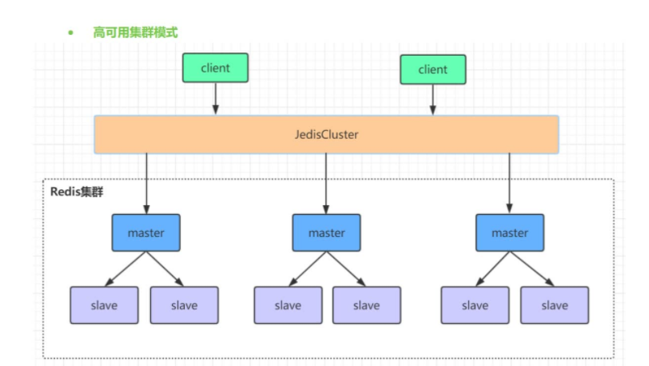
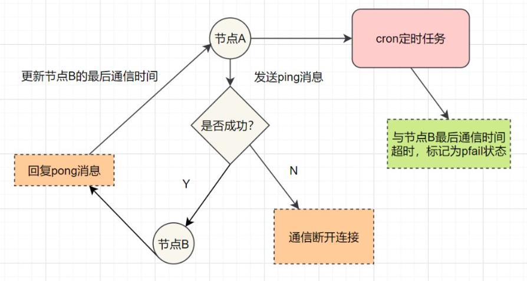
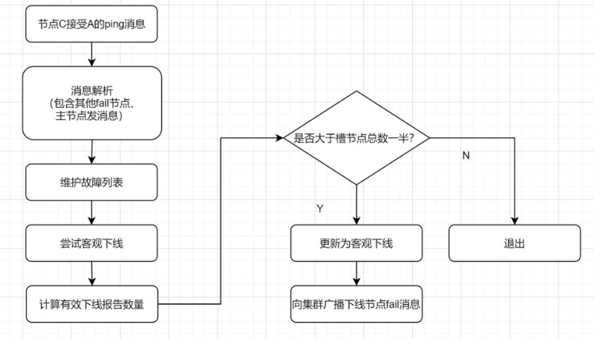
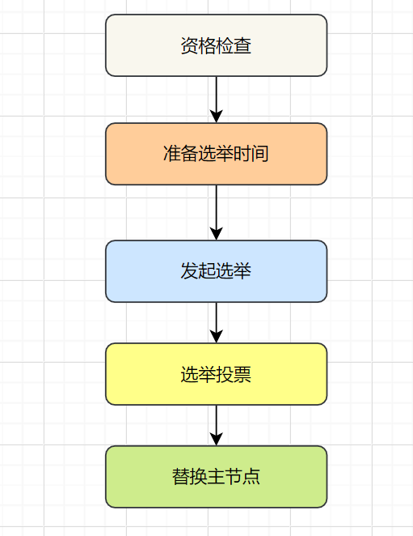

    redis集群是一个由多个主从节点群组成的分布式服务器群，它具有复制、 高可用和分片特性。
    Redis集群不需要sentinel哨兵∙也能完成节点移除和故障转移的功能。
    需要将每个节点设置成集群模式，这种集群模式没有中心节点， 可水平扩展，
    据官方文档称可以线性扩展到上万个节点(官方推荐不超过1000个节点)。
    redis集群的性能和高可用性均优于之前版本的哨兵模式，且集群配置非常简单

# Hash Slot插槽算法
    既然是分布式存储，Cluster集群使用的分布式算法是一致性Hash嘛？并不是，而是Hash Slot插槽算法。
    
    插槽算法把整个数据库被分为16384个slot（槽），每个进入Redis的键值对，根据key进行散列，分配到这16384插槽中的一个。使用的哈希映射也比较简单，用CRC16算法计算出一个16 位的值，再对16384取模。数据库中的每个键都属于这16384个槽的其中一个，集群中的每个节点都可以处理这16384个槽。
    
    集群中的每个节点负责一部分的hash槽，比如当前集群有A、B、C个节点，每个节点上的哈希槽数 =16384/3，那么就有：
    
    节点A负责0~5460号哈希槽
    节点B负责5461~10922号哈希槽
    节点C负责10923~16383号哈希槽

# Redis Cluster集群

    Redis Cluster集群中，需要确保16384个槽对应的node都正常工作，如果某个node出现故障，
    它负责的slot也会失效，整个集群将不能工作。

    因此为了保证高可用，Cluster集群引入了主从复制，一个主节点对应一个或者多个从节点。
    当其它主节点 ping 一个主节点 A 时，如果半数以上的主节点与 A 通信超时，那么认为主节点 A 宕机了。
    如果主节点宕机时，就会启用从节点。

    在Redis的每一个节点上，都有两个玩意，一个是插槽（slot），它的取值范围是0~16383。
    另外一个是cluster，可以理解为一个集群管理的插件。当我们存取的key到达时，
    Redis 会根据CRC16算法得出一个16 bit的值，然后把结果对16384取模。
    酱紫每个key都会对应一个编号在 0~16383 之间的哈希槽，通过这个值，去找到对应的插槽所对应的节点，
    然后直接自动跳转到这个对应的节点上进行存取操作。

    虽然数据是分开存储在不同节点上的，但是对客户端来说，整个集群Cluster，
    被看做一个整体。客户端端连接任意一个node，看起来跟操作单实例的Redis一样。
    当客户端操作的key没有被分配到正确的node节点时，Redis会返回转向指令，最后指向正确的node，
    这就有点像浏览器页面的302 重定向跳转。

故障转移

    Redis集群实现了高可用，当集群内节点出现故障时，通过故障转移，以保证集群正常对外提供服务。
    
    redis集群通过ping/pong消息，实现故障发现。这个环境包括主观下线和客观下线。
    
主观下线：

     某个节点认为另一个节点不可用，即下线状态，这个状态并不是最终的故障判定，
     只能代表一个节点的意见，可能存在误判情况。

客观下线

    指标记一个节点真正的下线，集群内多个节点都认为该节点不可用，从而达成共识的结果。
    如果是持有槽的主节点故障，需要为该节点进行故障转移。

    假如节点A标记节点B为主观下线，一段时间后，节点A通过消息把节点B的状态发到其它节点，
    当节点C接受到消息并解析出消息体时，如果发现节点B的pfail状态时，会触发客观下线流程；
    当下线为主节点时，此时Redis Cluster集群为统计持有槽的主节点投票，看投票数是否达到一半，
    当下线报告统计数大于一半时，被标记为客观下线状态。

故障恢复

    故障发现后，如果下线节点的是主节点，则需要在它的从节点中选一个替换它，以保证集群的高可用。流程如下：

    🚀 资格检查：检查从节点是否具备替换故障主节点的条件。
    🚀 准备选举时间：资格检查通过后，更新触发故障选举时间。
    🚀 发起选举：到了故障选举时间，进行选举。
    🚀 选举投票：只有持有槽的主节点才有票，从节点收集到足够的选票（大于一半），触发替换主节点操作