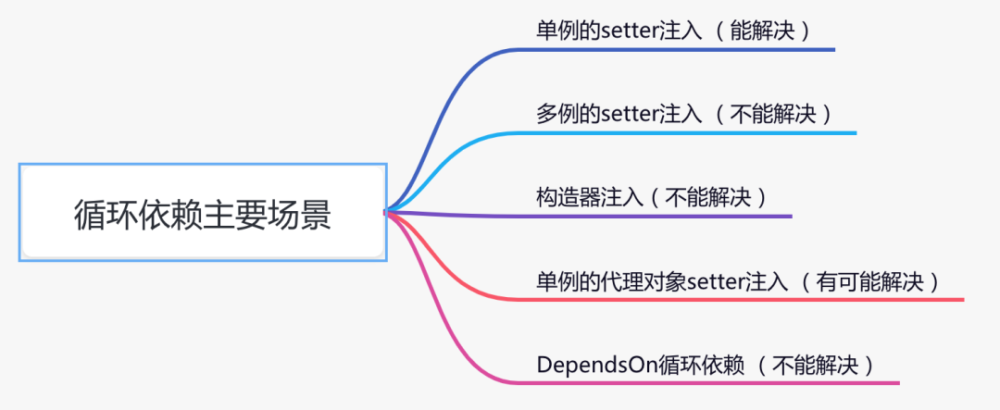

# Spring 如何解决循环依赖的

### 什么是循环依赖

循环依赖：说白是一个或多个对象实例之间存在直接或间接的依赖关系，这种依赖关系构成了构成一个环形调用




```java
@Service
public class TestService1 {
 
    @Autowired
    private TestService2 testService2;
    
    public void test1() {
    }
}
```

```java
@Service
public class TestService2 {
 
    @Autowired
    private TestService1 testService1;
 
    public void test2() {
    }
}

```

    
    这是一个经典的循环依赖，但是它能正常运行，得益于spring的内部机制，
    让我们根本无法感知它有问题，因为spring默默帮我们解决了。


spring内部有三级缓存：

    singletonObjects 一级缓存，用于保存实例化、注入、初始化完成的bean实例
    earlySingletonObjects 二级缓存，用于保存实例化完成的bean实例
    singletonFactories 三级缓存，用于保存bean创建工厂，以便于后面扩展有机会创建代理对象。


## 如何解决


生成代理对象产生的循环依赖，这类循环依赖问题解决方法很多，主要有：

    使用@Lazy注解，延迟加载
    使用@DependsOn注解，指定加载先后关系
    修改文件名称，改变循环依赖类的加载顺序

使用@DependsOn产生的循环依赖

    这类循环依赖问题要找到@DependsOn注解循环依赖的地方，迫使它不循环依赖就可以解决问题。

多例循环依赖

    这类循环依赖问题可以通过把bean改成单例的解决。

构造器循环依赖

    这类循环依赖问题可以通过使用@Lazy注解解决。
